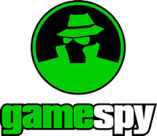
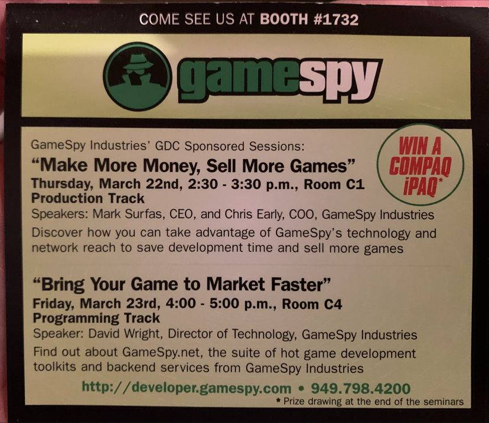

# Revivendo velhos tempos - Engenharia Reversa e Reimplementação do multiplayer de meus jogos antigos

Author: João Vitor (@Keowu) - Security Researcher

## Introdução

Este artigo visa documentar e também apresentar meus passos durante os estágios de engenharia reversa de três grandes clássicos da minha infância e adolecência. sendo eles Battlefield 1942, Vietnam e Halo CE a ideia por trás desse artigo se deu após eu encontrar meu antigo computador no sotão da minha casa. e ao liga-lo visualizar os icones em meu desktop destes grandes classícos. ao final deste artigo você vai ser capaz de entender como funcionam as implementações, protocolos de comunicação desses jogos, vamos reescrever totalmente todas as listas de servidores desses jogos permitindo que voltem de volta a vida como eram em sua época de glória, explicando cada detalhe e fornecendo todo o código fonte para posteriores pesquisas, usos. ou até mesmo regatar o sentimento de nostalgia dos clássicos. além disso você também sera capaz de reverter e reviver todos os classicos que tem a GameSpy SDK embutida neles.

### Uma segunda motivação

No clima nostalgico que esta pesquisa nos apresenta. outro grande clássico dos mundos dos games(em especial da minha terra natal. O Brasil), do meu youtuber favorito dos games Zangado e suas maravilhosas palavras de reflexões dos games e da vida.

PS: Não espero que um não nativo brasileiro entenda o peso desta referência(apenas respeite o momento), sendo assim siga com o decorrer do artigo.

### GameSpy da glória a Decadência

Se você jogou algum jogo clássico de franquias como Battlefield, Halo, Arma, Crysis, Star Wars. até Jogos multiplayer do Playstation 2(sim isso era possível) e Nitendo Wii. com toda certeza você usou algum serviço da GameSpy:

Gamespy foi criada pelo Engenheiro de Software Mark Surfas, e provia apenas serviços de listagem de browser para o Quake(1996) e também foi nessa época que começaram a comercializar o serviço para empresas desenvolvedores de jogos(como EA e seu Battlefield 1942, em 2002). porem foi em 2004 que o número de títulos que utilizavam o serviço teve um crescimento exponencial com a aquisição pela IGN.

A GameSpy mostrava-se viavel para desenvolvedores, em uma época que manter um serviço de multijogadores estável e funcional demandaria muito tempo de desenvolvimento. a SDK provia aos desenvolvedores tudo que era preciso, desde server browser, até autenticação(como no caso de alguns jogos como Battlefield 2, Battlefield 2142 e jogos do playstaion 2). SDK multiplataforma e facilmente portavel para diversas plataformas fornecendo apenas uma callback para os desenvolvedores obterem os dados necessarios focando apenas na criação e design do server browser dos jogos. até mesmo as interfaces e aplicações server-sides auto-hospedadas pelos jogadores utilizavam essa mesma base de SDK provida pela GameSpy. 

Infelizmente, manter um serviço desse tamanho era extremamente caro, e pouco rentável, foi então que em Abril de 2014 a IGN decide encerrar os seus serviços, matando completamente diversos títulos clássicos de diversas franquias clássicas. na época a IGN ofereceu o código fonte completo e backend as empresas que usavam seus serviços para que pudessem hospedar por conta e lançarem patchs corrigindo os jogos. algumas empresas como a EA Games, apenas ignoraram esse fator e deixaram suas franquias clássicas morrerem. outras como o caso da Bungie hospedaram o backend recebido da IGN em algum lugar, por exemplo a Bungie mantem uma instância EC2 da Amazon rodando o serviço de server browsing para seus clássicos como o Halo Combat Evolved, além é claro de lançarem um patch aos seus jogos corrigindo este problema. porem isso são excessões.

## Battlefield 1942

#### Analisando binário

#### Revertendo pacotes

#### Escrevendo um parser para pacotes

#### Analisando e criando ideias para modificações

#### Analisando padrões de código

#### Escrevendo uma nova masterserver provider

## Halo Combat Evolved

## Battlefield Vietnam

## Futuras ideias

## Bla, Bla Juridico

Ao escrever este artigo um advogado foi consultado. desta forma fui aconselhado a adquirir toda e qualquer licença possível de todos os jogos possíveis. sendo assim. os seguintes títulos foram adquiridos:

- Battlefield 1942 versão digital, adquirido de um colecionador registrado originalmente na plataforma Origin em 2010(mesmo ano de compra). 
- Battlefield Vietnam versão física, adquirido de um colecionador no qual comprou em uma loja GameStop em meados de 2006.
- Halo CE versão disponiblizada pela própria bungie.

Outros detalhes necessários:

- Efetuei diversas propostas ao suporte técnico da EA Games para adquirir a versão digital de Battlefield Vietnam. ambos insistiram que não era um jogo mais suportado e que não ligavam para o que ocorresse com ele. Um ponto positivo do suporte técnico da EA foi a tentativa por parte deles de ativarem a versão digital na minha conta e uma excelente atenção, até parabenizando pelo cuidado com as cópias desses clássicos.

Sendo assim tudo que foi necessario para construção deste artigo. desde a licença de softwares. como os próprios jogos são originais. e saliento que em nenhum momento uma versão jogavel sera disponibilizada(partes de arquivos de jogos bem como links para Websites de terceiros que contém devidos downloads não se enquadram em uma violação da lei da Seção 107 da Lei de Direitos Autorais de 1976 do Brasil), saliento que arquivos de patch ou melhoria também não se enquadram como uma violação de direito autoral, dessa forma o mesmo se aplica a todo código fonte e material gerado com este material.

## References

ALUIGI. A Luigi Papers. [S. l.], 27 abr. 2007. Disponível em: https://aluigi.altervista.org/papers.htm. Acesso em: 30 mar. 2024.

ERRI120. Breaking EA Desktop‘s pathetic Encryption. [S. l.], 18 jan. 2023. Disponível em: https://erri120.github.io/posts/2023-01-18/. Acesso em: 31 mar. 2024.