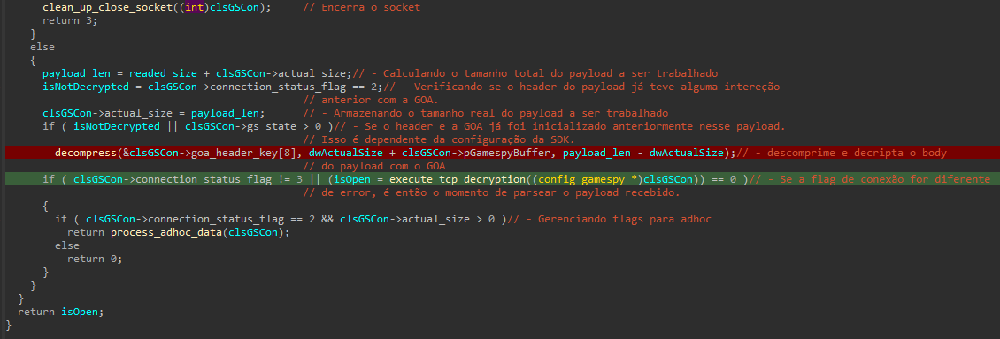

# Reescrevendo totalmente o suporte da GameSpy 2000 a 2004 usando engenharia reversa em jogos da EA e Bungie sem ser processado por direito autoral

Author: João Vitor (@Keowu) - Security Researcher

## Introdução

Este artigo visa documentar e também apresentar meus passos durante os estágios de engenharia reversa de três grandes clássicos da minha infância e adolecência. sendo eles Battlefield 1942, Vietnam e Halo CE a ideia por trás desse artigo se deu após eu encontrar meu antigo computador no sotão da minha casa. e ao liga-lo visualizar os icones em meu desktop destes grandes classícos. ao final deste artigo você vai ser capaz de entender como funcionam as implementações, protocolos de comunicação desses jogos, vamos reescrever totalmente todas as listas de servidores desses jogos permitindo que voltem de volta a vida como eram em sua época de glória, explicando cada detalhe e fornecendo todo o código fonte para posteriores pesquisas, usos. ou até mesmo regatar o sentimento de nostalgia dos clássicos. além disso você também sera capaz de reverter e reviver todos os classicos que tem a GameSpy SDK embutida neles.


## Table of Contents
1. [Introdução](#introdução)
2. TODO

### Uma leve motivação

No clima nostalgico que esta pesquisa nos apresenta. outro grande clássico dos mundos dos games(em especial da minha terra natal. O Brasil), do meu youtuber favorito dos games Zangado e suas maravilhosas palavras de reflexões dos games e da vida.

[](https://www.youtube.com/watch?v=j-wH8EPJ03U)

PS: Não espero que um não nativo brasileiro entenda o peso desta referência(apenas respeite o momento), sendo assim siga com o decorrer do artigo.

Essa pesquisa tem uma certa importância pessoal, enquanto escrevia lembrei-me de ótimos momentos com meus amigos do Ensino Fundamental e Médio, do quanto me diverti jogando esses clássicos, da quantidade de pessoas que conheci(brasileiros e estrangeiros) e de como a simplicidade nos faz Tão Feliz. nesta época com certeza eu não tinha acesso aos melhores hardwares do mercado mas o pouco que tinha, me moldaram a lutar e chegar nos meus objetivos. Não tinha um centavo, mas eu sempre tive uma visão. espero sinceramente que você não leia isso com o olhar de um idiota e superioridade, que afogue a sua própria idiotização e transforme suas ideias em uma incansável luta pela própria evolução!

! Além disso como de costume em meus artigos recomendo uma música, e desta vez escolhi: [Capital Inicial - Primeiros Erros](https://www.youtube.com/watch?v=jabmx3QoJGA), edit: ouvir depois de ler).

### GameSpy da glória a Decadência

Se você jogou algum jogo clássico de franquias como Battlefield, Halo, Arma, Crysis, Star Wars. até Jogos multiplayer do Playstation 2(sim isso era possível) e Nitendo Wii. com toda certeza você usou algum serviço da GameSpy:


Gamespy foi criada pelo Engenheiro de Software Mark Surfas, e provia apenas serviços de listagem de browser para o Quake(1996) e também foi nessa época que começaram a comercializar o serviço para empresas desenvolvedores de jogos(como EA e seu Battlefield 1942, em 2002). porem foi em 2004 que o número de títulos que utilizavam o serviço teve um crescimento exponencial com a aquisição pela IGN.

A GameSpy mostrava-se viavel para desenvolvedores, em uma época que manter um serviço de multijogadores estável e funcional demandaria muito tempo de desenvolvimento. a SDK provia aos desenvolvedores tudo que era preciso, desde server browser, até autenticação(como no caso de alguns jogos como Battlefield 2, Battlefield 2142 e jogos do playstaion 2). SDK multiplataforma e facilmente portavel para diversas plataformas fornecendo apenas uma callback para os desenvolvedores obterem os dados necessarios focando apenas na criação e design do server browser dos jogos. até mesmo as interfaces e aplicações server-sides auto-hospedadas pelos jogadores utilizavam essa mesma base de SDK provida pela GameSpy. 


Infelizmente, manter um serviço desse tamanho era extremamente caro, e pouco rentável, foi então que em Abril de 2014 a IGN decide encerrar os seus serviços, matando completamente diversos títulos clássicos de diversas franquias clássicas. na época a IGN ofereceu o código fonte completo e backend as empresas que usavam seus serviços para que pudessem hospedar por conta e lançarem patchs corrigindo os jogos. algumas empresas como a EA Games, apenas ignoraram esse fator e deixaram suas franquias clássicas morrerem. outras como o caso da Bungie hospedaram o backend recebido da IGN em algum lugar, por exemplo a Bungie mantem uma instância EC2 da Amazon rodando o serviço de server browsing para seus clássicos como o Halo Combat Evolved, além é claro de lançarem um patch aos seus jogos corrigindo este problema. porem isso são excessões.

## Battlefield 1942

Battlefield 1942 foi o primeiro clássico da franquia Battlefield lançado pela EA Games em 2002. ele contava com uma implementação de uma das primeiras SDKs desenvolvidas pela Gamespy. esta versão já continha a criptografia proprietária de pacotes apelidada de ```GOA```(Gamespy Online Access) este algoritmo combinava chaves randômicas simetricas e compressão de dados além de rounds shufle com XOR. em volta do payload recebido do MasterServer. esses dados eram então parseados, verificados, obtidos mais informações sobre os servidores e então retornado em uma função callback fornecida pela própria EA Games ao inicializar a struct de configuração do GameSpySdk(rotina essa apelidada de ```SBListCallBackFn``` com base em informações obtidas em metadados de binários dessa época).

#### Analisando binário

O binário original do jogo Battlefield 1942(versão de CD) não continha nenhum DRM como os atuais em seu binário, é claro que possuia alguma proteção anti-pirataria como é o caso do ```SafeDisc``` que utilizava o bom e velho driver vulneravel ```secdrv.sys``` que apenas impedia sua execução sem o disco original. facilmente ignorado com o advento da pirataria no Windows XP. atualmente é bem difícil encontrar essas versões já que apenas edições de colecionadores estão disponíveis no mercado. além disso no Windows 10 é inútil tentar carregar esse driver já que em 2015 a Microsoft simplesmente bloqueou seu carregamento devido a compatibilidade e segurança, já que existiam exploits para ele. Dado isso os desenvolvedores foram avisados bem antes sobre este problema, já que em 2012 a própria EA Games removeu a SDK do binário do jogo. adicionando então o Origin-DRM. Origin DRM(Agora EA-Launch DRM) utiliza AES para criptografar os dados de seções do binário PE de seus jogos, e as chaves são armazenadas conforme a licença do usuário em um arquivo apelidado de ```BF1942.par```. o processo de loading através desse DRM descriptografa todos os dados através de uma nova seção adicionada no binário PE sem nome:


Essa nova stub feita manualmente em assembly que carrega uma DLL apelidada de ```Activation.dll``` e chama seu export também sem nome utilizando apenas o ```ordinal```. a partir disso a DLL carregada reconstroi toda Tabela de Importação e descriptografa o conteúdo da seção ```.text``` em blocos de 16 bytes e por fim chama o Entrypoint original, veja a nova stub adicionada nos jogos reponsável por fazer esse procedimento:


O código do jogo é o mesmo das versões pirateadas encontradas na internet ```v1.61```, com a pequena diferença de não possuir não tem nenhuma alteração além de remover o DRM-SafeDisc.

Uma curiosidade é que os desenvolvedores da DICE usaram o ```VirtualXP``` e uma nova branch do SVN para gerar as buils do Jogo com a implementação do novo DRM:


Não entrarei em maiores detalhes de como esse DRM funciona, até porque existem conteúdos explorando outras partes do mesmo. além é claro de não querer problemas judiciais(dado que isso é uma pesquisa para reviver os jogos e não piratea-los). porem deixo a curiosidade da criatividade do time de segurança da EA Games ao proteger seus jogos.


Para continuar com a versão da Origin(Ea Launcher) você pode simplesmente deixar o loader fazer o trabalho pesado. reconstruir a IAT e apenas definir o EntryPoint(coisa que não sera demonstrado aqui), porem apenas saiba que tudo que for demonstrado aqui é aplicavel na versão da Origin/EA Launcher dado que a base de código é a exatamente a mesma, só que sem o DRM antigo.

Hoje em dia se você apenas obter uma cópia do Battefield 1942 de algum lugar, como Origin/EA Launcher, Disco ou de algum lugar nos confins da internet. e for jogar online simplesmente não vai ser possível, já que a lista de servidor não existe mais. porem se você encontrar algum endereço IP de servidor na internet, ou você mesmo hospedar um servidor é possível jogar adicionando-o nos favoritos.

**Você pode se perguntar o porque isso ocorre ?**

Basicamente quando você já conhece um endereço IP não há necessidade da masterserver list. já que a própria SDK da Gamespy envia requisições solicitando detalhes do servidor presente na lista e como ele esta ativo apenas retorna as devidas informações para você.

**Agora você deve estar se perguntando, como isso ocorre ??**

Vamos descobrir a partir de agora analisando e revertendo completamente o Battlefield 1942 com a implementação da SDK da Gamespy 2002 presente nele.


#### Revertendo pacotes

Algumas pessoas tiveram acesso a SDK completa do Gamespy no momento de fechamento dos servidores da Gamespy principalmente grandes servidores desses jogos que entraram em contato para obter, não sendo o meu caso. durante a demonstração de como funciona a comunicação entre cliente e masterserver. e cliente e servidor, usarei minha própria reimplementação da lógica usada pelo Masterserver da Gamespy revertido. e logo mostrarei a implementação no binário analisado do jogo.

O Battlefield 1942 utiliza as seguintes portas:

1. **28900** - Para comunicação ao Masterserver list provider através do protocolo TCP.
2. **23000** - Para comunicação e obter informações dos servidores através do protocolo UDP.
3. Demais conexões utilizam o protocolo TCP e não serão abordadas.

Quando uma nova solicitação de atualização da server browser ocorre, através do clique do botão abaixo:


Uma conexão TCP com o endereço da Masterserver através da porta 28900 é efetuado. e quando a conexão é aceita a primeira requisição é recebida pelo cliente:


O comando recebido pelo cliente é o seguinte:

```\\basic\\secure\\MASTER```

Este comando indica que um backend da Gamespy para server browser provider esta disponível para ser consultado. isso trata-se de uma apresentação do Masterserver ao cliente conectado.

Em seguida o Masterserver espera que o Cliente forneça uma query para o jogo em questão. essa query é composta pelas seguintes informações:

1. Gamename.
2. Versão do Jogo.
3. Location, sempre por padrão zero(isso é diferente no caso de implementações do Playstation 2, que possuiam jogos diferentes por região).
4. Validação, Uma chave hardcoded padrão. única para cada jogo, podendo ser considerado uma chave de API.
5. Enctype, padrão 2, porem isso se referia a versão do algoritmo do GOA(Gamespy Online Access)
6. O magic delimitador para indicar o final dos frames, nesse caso sempre ascii "final", isso vai fazer mais sentido ao decorrer da explicação.
7. Query ID com o padrão sempre sendo 1.1


Seguido disso temos a requisição última requisição a qual com base na query acima solicita que o Gameserver Provider envie o buffer comprimido e protegido com o algoritmo GOA(Gamespy Online Access):


Diferente do ```query```. o list não tem nenhum significado ou configuração a ser explicado ele apenas fara o request do buffer contendo o payload com os servidores a serem usados.

Por último após todo esse processo o buffer protegido é enviado pelo masterserver provider totalmente criptografado(não sendo o meu caso, porque eu removi o algoritmo já que minha solução simplesmente não precisa dela):


Antes de explicar como isso foi implementado e mostrar toda a explicação da engenharia reversa por trás. esta é uma masterserver provider real hospedada no brasil escrita e revertida no meu tempo livre, que agora vai se tornar OpenSource. 


Vamos olhar como as requisições ocorrem diretamente na implementação da SDK da Gamespy presente no Battlefield 1942. 

#### Revertendo o código fonte e implementação da Gamespy

Vamos iniciar pelo procedimento apelidado por mim de ```decrypt_tcp_trafic```, Uma curiosidade aqui é que a SDK da Gamespy era completamente desenvolvida em C. e deveria ser feito mesmo, até porque isso facilitava muito ao portar para outras plataformas/arquiteturas. bom, continuando. voltando a explicação do procedimento, ele é responsável por definir configurações ao socket, e ler o buffer que estiver pendente nele, descomprimir, e descriptografar, tudo isso com o tamanho máximo de 2047(sendo esse, o tamanho máximo que um buffer da Gamespy pode suportar), além é claro de parsear os dados e adicionar em uma callback(da própria Gamespy) para que sejam validados e por fim adicionados a uma lista ligada e passados a callback fornecida por quem implementava a SDK, nesse caso, a DICE. outras callbacks também eram implementadas como para tratativas de erros, tudo fara mais sentido conforme eu apresento.

Começando do início temos uma chamada para ```select``` e seguido de uma chamada para ```recv```. o objetivo aqui é monitoras eventos para leitura do socket  definindo um timeout de 0 segundos para cada evento de leitura do socket TCP estabelecido. retornando um código de erro ao GameSpy Switch(um bloco de código que intereja em loop responsável por responder a eventos externos direcionados ao SDK além de eventos do socket como de apresentação e autenticação no Masterserver provider) o código retornado em questão é ```STATUS_TIMEOUT_ERROR```(obviamente isso foi definido por mim com base na analise do comportamento do código e minha interpretação dele). logo após ocorre de fato a leitura do buffer com tamanho máximo de ```2047``` esse valor constante é o tamanho máximo que um payload(conjunto criptografado ou descriptografado com os frames de servidor para consulta) pode assumir aqui perceba também que uma global é utilizada ```readed_buffer``` uma DWORD que em questão armazena o valor já lido com o tamanho do payload anteriormente caso uma nova intereção seja necessária. isso ocorre por exemplo se por algum motivo o payload estiver corrompido.


Todos os dados lidos do payload são armazenados em uma global. em um ponteiro composto por duas globais. e aqui mais uma vez chama a criatividade da implementação. a primeira global ```FirstFrameByte``` é um byte. seguido de ```readed_buffer``` que carrega o offset/tamanho do buffer anterior, cabe-se destacar que na maioria das vezes esse valor se assume ```0``` por padrão. 

Você deve estar se perguntado agora:

**Como assim um único byte não vai transbordar ?**


A resposta é, sim! e esse é o objetivo mesmo. o desenvolvedor alinhou muito bem os dados. ao ler o buffer sempre vai ser com um tamanho superior a um byte dessa forma sobrescrevendo outra variavel global apelidada de ```frame_buffer``` ela que de fato vai carregar o buffer sem o magic byte(que por coincidencia é sempre um único byte que com um XOR ```0xEC``` resulte em algo superior a 0, quando zero indica que a geração do payload foi negada), veja um exemplo:


Agora com os devidos dados, hehe:


Seguido disso temos as verificações do tamanho do buffer lido:


Seperei este trecho para mostrar coisas curiosas para você leitor. aqui podemos ver as validações feitas pela Gamespy em relação a tratativa de erros quando um buffer não é obtido do socket TCP. mas perceba que como mencionado por mim anteriormente. uma callback registrada por quem implmentou a SDK em determinado jogo é registrado. ```clsSocket->GamespyCallback``` nada mais é que um endereço de um procedimento da própria DICE que recebera o código de erro forneceido pela Gamespy e com base em um switch case tratara exibindo a devida mensagem de erro para ele. uma segunda curiosidade aqui é que os parâmetros na declaração podem assumir qualquer coisa por quem implementar já que é um ```PVOID```. nesta mesma callback as informações de lista ligada de servidores são retornados.

Bom, indo mais a fundo vamos entender como os dados de um raw buffer, que é um payload, vão ser tratados até obtermos informações relevantes que nos permitam entender o que trafega nesse procedimento.


A partir de agora vamos ver a utilização do GOA(Gamespy Online Access) em dois procedimentos, o primeiro ```decompress_one``` e o segundo em ```decompress_two```, além do primeiro estágio de parsing dos dados em um ponteiro para uma struct de dados revertida por mim, a ```server_data_struct```.

A primeira verificação em ```clsSocket->already_decrypted != -1``` é usada nos casos já mencionados acima, onde a descriptografia dos payload já foi feita anteriormente, porem ele estava corrompido de alguma forma, então não há necessidade de trabalhar com os cabeçalho novamente, apenas com os dados do body do payload. e o algoritmo responsável por isso estão no procedimento ```decompress_two```. Avançando, caso seja a primeira interação com os dados do payload veremos todo o processo de descompressão e inicialização da chave e decompressing do cabeçalho de dados, o marco para inicio dessa etapa é a comparação em ```already_decrypted == -1```:


Logo no início desta etapa a primeira verificação usando o byte magic 0xEC ocorre, seguido também da inicialização da chave que esta no cabeçalho do payload através da operação de XOR ```frame_buffer[i] ^= clsSocket->ucRandomicKeyBytes[i + 40]``` a cada inicialização as chaves em ```ucRandomicKeyBytes``` mudam e são construídas com base em um rand, mas esse é só o primeiro layer de criptografia em cima dos dados que ainda contam com a compressão. após a inicialização da chave o procedimento ```decompress_one``` é usado para descriptografar o cabeçalho do payload. logo após isso já temos o valor do offset para o body do payload que é determinado pelo XOR do byte magic com 0xEC ```FirstFrameByte ^= 0xECu``` onde era utilizado para acessar ```frame_buffer``` interpretado como uma referência ```PVOID``` que posteriormente identifiquei se tratar de uma struct(pois era acessada via indices no assembly, similar a padrão adotados por structs), dessa forma criei a seguinte struct:

```c++
struct server_data_struct {

  DWORD server_ip;
  WORD server_port;

};
```

Onde cheguei no seguinte resultado, facilitando melhor nossa visualização do que ocorria:

```c++
gameservers = (server_data_struct *)&frame_buffer[FirstFrameByte]
```

Onde por fim era utilizada como argumento para que o conteúdo do body do payload fosse descriptografado com uma chamada para "decompress_two", no seguinte trecho:

```c++
decompress_two(clsSocket->ucBuffer, gameservers, (PVOID)(&FirstFrameByte + readed_buffer - (UINTPTR)gameservers));
```

Essa era toda a rotina de criptografia e trabalho com o frame adotado pela Gamespy nessa versão. apesar de ter feito um porte completo dessa rotina de descriptografia mais a diante em x86. eu não dediquei tempo em analisa-la a fundo. no entanto ela era a mesma compartilhada por diversos jogos que usavam essa versão da SDK, caso você se interesse em entender recomendo ler o paper de um outro pesquisador independente, ```LUIGI. Auriemma``` em específcio em um paper apelidado de ```GS enctype2``` disponível nas referências do artigo. mais adiante introduzi uma nova criptografia nesses frames utilizando uma implementação modificada e pessoal do XTEA, apelidada de ```TeaDelKew```.

Logo após todo esse processo em relação ao algoritmo de descriptografia chegamos a etapa de criação da lista ligada responsável por criar uma fila de processamento para verificar o estado do servidor utilizando o protocolo ```UDP``` com a porta padrão ```23000```.


Nesse procedimento cada membro da struct é acessado, o IPV4, a PORTA. e o ponteiro da struct é incrementado em 6 bytes. o tamanho exato da própria struct para acessar o próximo conjunto de dados. logo em seguida todos esses dados são passados como argumento para a lista ligada. em ```add_to_list_to_check_status_via_UDP```. 

Se você estiver se perguntando como é definido o tamanho máximo do payload nesse parsing. ele ocorre com base na assinatura(UTF-8) ```\\final\\```:


Nesse procedimento quando o último frame for parseado a endFlag assumira o valor padrão 7. e então o procedimento é encerrado. tudo isso enquanto não for encontrado a assinatura ```\\final\\``` que delimita exatamente o tamanho máximo caso algo falhe.

Vamos agora dirigir nossa atenção em como a validação dos servidores é feita pela Gamespy SDK usando o protocolo UDP. essa verificação pode ser considerada uma especíe de heart-beat, já que a comunicação ocorre apenas para obter detalhes do servidor como números de jogadores, mapas e nome do mapa jogado. vamos iniciar analisando os pacotes:


Quando a Gamespy SDK vai verificar um servidor, o primeiro comando enviado é o ```\status\```, este comando é usado para solicitar as devidas informações de heart-beat do servidor em questão. o servidor então responde com outros payloads, como do exemplo abaixo:

```
\gamename\bfield1942\gamever\v1.61\language\English\location\1033\averageFPS\0\content_check\0\dedicated\1\gameId\bf1942\gamemode\openplaying\gametype\ctf\hostname\NOME DO SERVIDOR | LOL NOME DO SERVIDOR\hostport\14567\mapId\BF1942\mapname\wake\maxplayers\64\numplayers\36\password\0\reservedslots\0\roundTime\1200\roundTimeRemain\274\status\3\sv_punkbuster\0\tickets1\0\tickets2\4\unpure_mods\\version\v1.61\active_mods\bf1942\allied_team_ratio\1\allow_nose_cam\yes\auto_balance_teams\on\axis_team_ratio\1\bandwidth_choke_limit\0\content_check\0\cpu\3766\external_view\on\free_camera\on\game_start_delay\15s\hit_indicator\on\kickback\10%\kickback_on_splash\10%\name_tag_distance\200\name_tag_distance_scope\350\number_of_rounds\1\soldier_friendly_fire\40%\soldier_friendly_fire_on_splash\40%\spawn_delay\4s\spawn_wave_time\7s\sv_punkbuster\0\ticket_ratio\250%\time_limit\30\tk_mode\forgive\unpure_mods\\vehicle_friendly_fire\40%\vehicle_friendly_fire_on_splash\0%\queryid\6903.1
```


**Ficou confuso em relação as informações retornadas ?**

Primeiramente, na época de lançamento "json" nem era tão comum assim, na realidade ele estava começando a engatinhar(já que ele surgiu nesse mesmo ano). mas isso não é um problema, tirando que as versões de 2005/2006 que utilizavam o XML nas comunicações da Gamespy, porem isso era padrão mesmo para o sistema de registro de jogadores, já este modelo apresentado era bem comum e funcionava muito bem para o padrão necessário. esse padrão não era exclusivo para a DICE/EA ou seja esse mesmo modelo era compartilhado entre os jogos da época. diferente aqui são apenas as informações que eram recebidas, já que cada jogo parseava de maneira diferente. alguns padrões se mantinham, destacarei eles agora:

- **gamename** - Representa o nome do jogo que o servidor era dirigido nesse caso "bfield1942"
- **gamever** - Representa a versão do jogo, nesse caso é v1.61(a versão mais atual do jogo) e caso essa versão fosse diferente do cliente uma callback de erro é ativada
- **hostname** - Representa o nome do servidor em questão
- **hostport** - Representa a porta do servidor
- **queryid** - Representa o id da query feita naquele servidor, nesse caso 6903.1

Esses eram apenas a parte padrão do frame(que outros jogos também possuem) mas a Gamespy era altamente adaptavel e todos os outros fields eram direcionados ao Battelfield 1942.

A primeira parte apresentada era apenas a introdução recebida do servidor. outras informações padrões também eram recebidas, como por exemplo informações dos jogadores atuais daquele servidor, K/D(Kill, Death), ping e time jogado. além é claro da keyhash(algo bem curioso que vou apresentar em breve para o que ela serve).

```
\deaths_0\2\keyhash_0\e09833b4065c325fbe042d4c7cf8bba9\kills_0\0\ping_0\41\playername_0\[Admin]Cher\score_0\0\team_0\1\deaths_1\10\keyhash_1\d8e803a4c432c5dbc129805bb13c5ae9\kills_1\0\ping_1\52\playername_1\Jim Lahey\score_1\13\team_1\1\deaths_2\0\keyhash_2\92ff73033c3351d61131b3129990aa77\kills_2\0\ping_2\17\playername_2\jake from state farm\score_2\0\team_2\1\deaths_3\7\keyhash_3\114d0844ea3df43d48840016f2b4a7ae\kills_3\17\ping_3\24\playername_3\TheCalmingClam\score_3\34\team_3\2\deaths_4\2\keyhash_4\93b6ad5f0452ee5ff76702ae3f071e9e\kills_4\19\ping_4\21\playername_4\mediocre\score_4\23\team_4\2\deaths_5\4\keyhash_5\860bd844411700821c06d91751a22f13\kills_5\10\ping_5\25\playername_5\*Incognito*\score_5\26\team_5\2\deaths_6\12\keyhash_6\e189e41fc7254f4f1ad351b0aadeeeeb\kills_6\4\ping_6\151\playername_6\GLIER\score_6\13\team_6\2\deaths_7\6\keyhash_7\8f2cbe5d55b6f974199a0136b91791c4\kills_7\7\ping_7\31\playername_7\Lagtastic\score_7\26\team_7\1\deaths_8\7\keyhash_8\d0db7b12341ec39e07dbf686d7c0663e\kills_8\1\ping_8\77\playername_8\papi\score_8\12\team_8\2\deaths_9\9\keyhash_9\57592dcf0786e10a376577ad33c9d8d6\kills_9\7\ping_9\59\playername_9\Meuse\score_9\13\team_9\1\deaths_10\7\keyhash_10\8e024e9945e8cef5565e7eb67c63356b\kills_10\7\ping_10\44\playername_10\Sorrowful Rice\score_10\40\team_10\2\deaths_11\17\queryid\6903.2
```

Como mencionado aqui todos os fields eram customizados para o Battlefield 1942, diferentes de outros jogos. é claro que ainda tinha algum padrão como é o caso da própria ```queryid```. A ```keyhash``` era exatamente a hash do seu serial de ativação armazenado em algum lugar do sistema operacional(chave de registro nesse caso).

Uma curiosidade do jogo é que a verificação de serial era feita ao lado do cliente, e isso funcionava da seguinte forma: Imagine que você deseja entrar em um servidor mas o seu serial é o mesmo de um jogador já conectado, isso era validado através do field ```keyhash```. e caso o seu fosse o mesmo de um jogador já conectado, você receberia um erro(uma callback de verificação da Gamespy, a mesma já detalhada anteriormente).

**Um problema aqui é que se você copiar alguma dessas keyhash e substituir pela sua você consegue se passar por outro jogador.**


##### [Bonus] Explorando segurança das chaves de registro para abusar do problema de serial dos sevidores para desconectar jogadores

Se você também estiver curioso de onde essas informaçoes de serial estão armazenadas, nada melhor do que crackear um keygen/changer, obviamente sem entrar no critério de pirataria. eu reverti um antigo changer de serial do Battlefield 1942, esse changer usava o packer ```ASPack``` e era completamente feito em ```Delphi```:


Este software se tratava apenas de um changer. seu objetivo era apenas alterar as chaves de ativação do jogo. ele não era um keygen. sua única validação era se o serial cumpria com o tamanho de 22 digitos. e apenas o gravava em duas chaves de registro sem nenhuma segurança, como demonstrado abaixo:

```\\SOFTWARE\\Electronic Arts\\EA GAMES\\Battlefield 1942\\ergc\\```


```\\SOFTWARE\\Aps\\cdkey\\```


###### Como era gerado a hash para a serial key ? a mesma usada nos servidores para verificação ?

Para responder essa pergunta, podemos olhar a própria implementação do Battlefield 1942:


O valor armazenado na chave de registro é passado utilizado para gerar uma hash MD5 dos valores. é possível confirmar que se tratava de um MD5 apenas observando as constantes de inicialização presentes no procedimento "generate_data_md5":


Além do output bater com alguns softwares de keygen disponíveis na internet, além do meu próprio teste para confirmar:


Se você estiver se perguntando o que aconteceria se dois seriais com a mesma hash estivessem em um mesmo servidor, ambos levariam disconnect, e podemos abusar disso apenas hookando um procedimento de implementação do MD5, sera que podemos considerar uma vulnerabilidade ? fique a sua própria interpretação pessoal sobre o assunto.


##### Analisando a implementação de verificação de servidores da Gamespy SDK no Battlefield 1942

Após entendermos como o serial funcionava e suas vulnerabilidades de segurança, Agora vamos retornar nossa atenção para ver como a verificação de servidores era implementado pela Gamespy SDK, diretamente no fonte da implementação do Battlefield 1942.

O procedimento apelidado por mim de ```receive_data_from_masterserver``` é responsavel por verificar cada servidor individualmente da lista anteriormente obtida com o parseamento das informações do payload recebido da masterserver. com cada frame(entrada de struct na lista) verificando-se o tamanho total de servidores na mesma inicia-se o envio do comando de query para cada servidor individualmente através de uma chamada para "sendto" usando o index 0 da command query:


A global mencionada ```g_command_to_send``` contem todos os comandos que pode-se ser enviado durante as querys, claramente, com a devida ordem correta aos servidores. porem aqui apenas o índice ```5``` é utilizado pois indica-se o inicio de uma nova query de status de um servidor no qual já conhecemos:


```! Apesar de não demonstrado aqui. Os demais comandos também podem ser usados para você obter diversas informações dos servidores Gamespy, indo desde informações básicas, regras, players, e regras.```

A flag ```status``` força que todas as informações possíveis do servidor sejam enviadas, isso ocorrera até que um ```\\final\\``` seja encontrado indicando o final dessas informações, como podemos comprovar com base no entendimento do código original:


A cada informação obtida uma cabblack da gamespy registrada pela DICE/EA recebera os dados, os parseando conforme desejado de maneira separada e já organizada. essa callback é chamada até que todos os frames sejam recebidos, delimitados pela tag "final".

Como curiosidade e também se você estiver se perguntando, sim existe uma callback de tratativas de erros, caso alguma coisa falhe durante o recebimento das informações dos servidores:


Vamos entender como os frames são organizados com base nas informações descobertas e apresentadas acima, para esse exemplo estou usando um payload já descriptografado e descomprimido pelo ```GOA```(Gamespy Online Access):


Destaquei com cores para ficar mais fácil explicar o que são cada partes que compõem um payload da GameSpy.

- Iniciando pela cor Vermelha totalizando exatos 0x13 bytes temos a Frame Signature a assinatura do payload atual ela não importa muito, porem a SDK espera que sempre sejam devidamente assinados.
- Nos bytes na cor Laranja Claro, temos os servidores e portas organizados na estrutura: 4 Bytes para IPV4(DWORD) e 2 Bytes para porta(WORD), tudo isso de maneira sequêncial.
- Nos bytes na cor Bege, temos a assinatura "final" que delimita o final do payload em questão.
- Tudo isso limitado a 0x7FF que é o tamanho máximo que um payload pode possuir.

**Curiosidade, se você estiver se perguntando o porque de o tamanho ser limitado a 0x7FF e o que acontecia se tivessemos mais servidores do que o esperado para um payload.** a Resposta é simples, porque esse é o tamanho máximo que a server browser poderia suportar, e quando tinhamos mais servidores que isso apontado para masterserver então alguns eram pegos de maneira sortida até completar o tamanho máximo e por fim ser criado um novo payload e retornado ao solicitante. é exatamente por isso que causava a randomização dos servidores na server browser list gerando oportunidades para diversos servidores aparecerem nela.

#### Escrevendo um parser para pacotes

Após conhecermos como funcionava a implementação da gamespy e como a comunicação entre cliente e servidor ocorria, é hora de escrevermos um parser para isso! para isso estabelecerei alguns objetivos para nosso parser, sendo eles:


- Parsear completamente os payloads
- Organizar informações em constantes
- Organziar listas de servidores
- Printar e obter todas as informações de um payload
- Adicionar novos servidores
- Remover servidores
- Verificar status de servidores
- Gerar novos payloads

Iniciei pelo básico, criei um novo projeto apelidado de "EAGamesNetworkFrameParser" nele criei uma nova classe chamada "BF1942FrameNetParser" para armazenar todos os métodos para manipular nossos payloads.

Nesta classe criei uma nova struct para armazenar nossos servidores, chamada de "BF1942gameServers":

```c++
typedef struct BF1942gameServers {

	/*
		IPV4
	*/
	uint32_t dwServerIP { 0 };

	/*
		PORT
	*/
	uint16_t dwServerPort { 0 };

	/*
		Data to Display on SERVER BROWSER
	*/
	std::string status_response;

};
```

Além da struct para armazenar informações dos servidores presentes no payload criei constantes para Status-Query, End-Signature, Max-PayloadSize e Max-StatusQuery(tamanho máximo que um payload de query de servidor pode ter):

```c++
const char* m_endSignature{ "\\final\\" };
const char* m_stausQuery{ "\\status\\" };
const int MAX_STATUS_SIZE{ 0x5DB }; // MAX status size
const int MAX_PAYLOAD_SIZE{ 0x7FF }; // MAX payload size
```

Também criei declarações para dois raw pointers privados para a classe. o primeiro sera utilizado para armazenar todo o buffer de um payload ```m_ucRawFrame```, já o segundo buffer chamado de ```m_ucNewFrame``` armazenara todo o buffer alterado posteriormente por quem implementar a classe e desejar modificar o payload.

```c++
unsigned char* m_ucRawFrame{ NULL };
unsigned char* m_ucNewFrame{ NULL };
```

Seguido disso, criei os seguintes métodos públicos focados nos nossos objetivos traçados:

```c++

// Construtor para a nossa classe recebendo um path para o payload a ser trabalhado
BF1942FrameNetParser( std::string& strFilePath );

// 1º Método responsável por adicionar um novo servidor ao payload
auto addNewServer( const char* chSeverIp, const char* chSeverPort, bool check=true ) -> bool;

// 2º Método responsável por remover um determinado servidor adicionado ao payload, usando o índice para isso
auto removeServer( int index ) -> void;

// 3º Método responsável por gerar um novo payload com os dados atualizados dos servidores
auto getNewPayload( ) -> unsigned char*;

// 4º Método responsável por obter o payload raw. nesse caso um raw pointer para nosso payload em questão
auto getRawPayload( ) -> unsigned char*;

// 5º Método responsável por escrever um novo payload gerado em disco, basicamente isso gerara um novo payload com os dados atualizados e então chamara rawpayload para obter um raw pointer com o buffer para então escrever seu conteúdo no path específicado
auto writeNewPayload( std::string& path ) -> bool;

// 6º  Método responsável por verificar se um servidor esta ativo e obter todas as informações básicas sobre o mesmo. para isso é necessário uma struct BF1942gameServers contendo os dados do servidor a ser verificado
auto checkServerStatus( BF1942gameServers* bfg ) -> bool;

// 7º Método operator responsável por obter uma std::string com todas as informações dos servidores presentes em um payload
operator std::string( ) const;
	
// 8º Destructor para cleanup das informações usadas por nossa classe de parser de payload
~BF1942FrameNetParser( );
```

Após essa pequena organização e padronização, iniciei a implementação do nosso parser em si. 

A iniciar pela lógica do construtor da classe, ele vai ser o responsável por separar e organizar os devidos procedimentos presentes no payload. para isso como mencionado obtive todo o buffer do arquivo na variavel privada "m_ucRawFrame" e a utilizei como base para trabalhar. primeiramente extrai a assinatura e a armazenei e avancei para o body do payload:

```c++
	
//Extraindo a assinatura do payload
std::memcpy( this->m_ucFrameSignature, this->m_ucRawFrame, sizeof( this->m_ucFrameSignature ) );

//Avançando para o início do body do payload
auto ptr = this->m_ucRawFrame;
ptr += sizeof( this->m_ucFrameSignature );
```

Após isso escrevi a lógica para extrair os servidores até que a assinatura final fosse encontrada em "m_ucRawFrame":

```c++

while ( std::memcmp( ptr, m_endSignature, sizeof( m_endSignature ) ) != 0 ) {

	BF1942gameServers srv{ 0 };

	std::memcpy( &srv.dwServerIP, ptr, sizeof( uint32_t ) );

	ptr += sizeof( uint32_t );

	std::memcpy( &srv.dwServerPort, ptr, sizeof( uint16_t ) );

	ptr += sizeof( uint16_t );

	this->m_servers.push_back( srv );

}
```

O código acima repete até encontrar a assinatura que delimita o final, e enquanto repete vai extraindo cada DWORD-4 Bytes que representam um IPV4 e avançando para encontrar os 2 Bytes-WORD que representam a porta colocando os dados coletados em uma nova instância da struct ```BF1942gameServers``` e adicionando em um std::vector.

Com isso já temos todas as informações devidamente separadas do nosso payload original, e segui para implementar nosso operador ```std::string( )``` nessa etapa apenas organizei os bytes referidos que representavam o IPV4 e a porta e retornei tudo organizado em uma única std::string:

```c++
for ( auto bfServer : this->m_servers )

	out << ( bfServer.dwServerIP & 0xff ) << "." << ( ( bfServer.dwServerIP >> 8 ) & 0xff ) << "."
			<< ( ( bfServer.dwServerIP >> 16 ) & 0xff ) << "." << ( ( bfServer.dwServerIP >> 24 ) & 0xff )
			<< ":" << _byteswap_ushort( bfServer.dwServerPort ) << "\n";
```

Ficando dessa forma:


Com esse resultado prossegui para a implementação do método para adicionar novos servidores na nosso vector de servidores ```m_servers```. e para isso adotei os seguintes passos:

Primeiramente inicializei uma nova struct ```BF1942gameServers```:

```c++
BF1942gameServers srv{ 0 };
```

Segundamente preparo o parsing das informações a partir de um raw pointer ```const char*```, organizando os dados individualmente nos fields da struct inicializada:

```c++
int b1{ 0 }, b2{ 0 }, b3{ 0 }, b4{ 0 }, port{ 0 };

sscanf_s( chSeverIp, "%d.%d.%d.%d", &b1, &b2, &b3, &b4 );

sscanf_s( chSeverPort, "%d", &port );

srv.dwServerIP = (b4 << 24) |
		 (b3 << 16) |
		  (b2 << 8) |
		  	  b1;

srv.dwServerPort = _byteswap_ushort( port );
```

Em seguida iniciei a implementação da lógica para verificar o status do servidor usando a query server-browser status, centralizando no procedimento ```checkServerStatus```:

```c++
.
.
if (sendto(sockfd, this->m_stausQuery, strnlen_s(this->m_stausQuery, 20), 0, reinterpret_cast<struct sockaddr*>(&serverAddr), sizeof(serverAddr)) == SOCKET_ERROR)
.
.
recvfrom(sockfd, chBufferStatus, MAX_STATUS_SIZE, 0, reinterpret_cast<struct sockaddr*>(&serverAddr), &msForcingAPointer);
.
.
bfg->status_response = std::string(chBufferStatus);
.
.
return true;
```
Caso o servidor a ser adicionado passe na validação do status, prossigo para adicionar a instância da struct para esse servidor servidor no vector ```m_servers```.

Não comentarei a implementação do procedimento ```removeServer``` pois ele é muito simples já que é apenas a exclusão de um item do vector ```m_servers```.

Focando na explicação do procedimento ```getNewPayload``` ele é o responsável de gerar um novo payload do zero com todas as informações alteradas e adicionadas pelo nosso parserm:

Primeiro alocaremos um novo buffer com o tamanho máximo que o payload pode assumir:

```c++
this->m_ucNewFrame = new unsigned char[ MAX_PAYLOAD_SIZE ] { 0 };
```

Logo em seguida copiamos a assinatura do payload:

```c++
std::memcpy( this->m_ucNewFrame, this->m_ucFrameSignature, sizeof( this->m_ucFrameSignature ) );
```

Com base em cada servidor no vector ```m_servers```, inicio a copia para o novo payload:

```c++
for ( auto server : this->m_servers ) {

	std::memcpy( ptr, &server.dwServerIP, sizeof( uint32_t ) );

	ptr += sizeof( uint32_t );

	std::memcpy( ptr, &server.dwServerPort, sizeof( uint16_t ) );

	ptr += sizeof( uint16_t );

}
```

E após isso incluo a assinatura que delimitara o final do payload para o parser da GameSpy SDK 2002:

```c++
std::memcpy( ptr, m_endSignature, strnlen_s( m_endSignature, 10 ) );
```

Os demais procedimentos também foram implementados por mim seguindo a mesma lógica, mas não considerei tão relevante destaca-los aqui, sendo eles respectivamente:
```
writeNewPayload
getRawPayload
~BF1942FrameNetParser
```
Consulte o código fonte sempre para uma alta precisão na implementação.

Enfim ao final de tudo temos o nosso parser dos payloads completamente funcional:


Enfim conseguimos vencer essa etapa, vamos adiante com nossa pesquisa.


#### Analisando e criando ideias para modificações

Agora vamos colocar a mão na massa e modificar a implementação da GameSpy adicionando nosso próprio código para trabalhar com nosso próprio payload e dessa forma reviver a Server Browser do Battlefield 1942. faremos isso através de um módulo apelidado por mim de ```kurumi``` a ideia é fazer algo adaptavel e inteligente para cumprir com nosso objetivo.

#### Analisando padrões de código

Irei Iniciar a apresentação da implementação e modificação do código da GameSpy vou apresentar onde e o porque escolhi determinadas rotinas para sobrescrever/reescrever em uma nova região direcionando a execução do código mantendo assim a compatibilidade com o código original, e claro como usei um framework super performático e estável para disassemblar e para manter a compatibilidade dessas implementações.

O projeto da Kurumi foi organizado de uma forma bem simples contando apenas com dois arquivos, sendo um deles complemente escrito em Intel Assembly com foco para suporte ao Masm(Microsoft Macro Assembler) evitando usar recursos novos da linguagem C++ devido a possíveis imcompatibilidades que poderiam surgir com o Battlefield 1942.

Ao todo trabalhei em apenas cinco pontos específicos da implementação da GameSpy, isso já considerando redirecionamento de códigos para implementações próprias ou patchs muito específicos. criei uma struct de configuração na "Kurumi" chamada de ```BF1942_GS_NETWORK``` e cada field foi nomeado com um nome mais amigável por mim:

- bf1942->pReadBuffer
- bf1942->pGamespyDecompressRoutine
- bf1942->pSetReadBufferGsReturn
- bf1942->pSetDecryptRoutineGsReturn
- bf1942->pFirstByteAddrMagicByte

 O primeiro destes pontos é o ```pReadBuffer``` originalmente essa rotina era responsável por gerenciar os buffers lidos a partir do socket TCP estabelecido com a Master Server List Provider. A Kurumi insere um simples código de redirecionamento que armazena todo o contexto de registradores e em seguida o redireciona para um área de meu próprio controle onde reimplementei completamente a lógica original em assembly com a única diferença que um buffer de meu controle sera utilizado, como a ideia da implementação é ser menos intrusivel possível adotei essa ideia ao implementar, veja um exemplo:


Esta é a rotina original da GameSpy que reescreverei em uma nova região sem limitação para adicionar meu próprio handler do buffer a ser lido:


O segundo destes pontos é o ```pGamespyDecompressRoutine``` ele é responsável por descomprimir o buffer recebido e desencriptar seu conteúdo, porem agora nosso buffer não requer esse recurso, então substituimos o handler original da GameSpy por um de nosso próprio controle com as informações que foram lidas de nossa alteração anterior ```pReadBuffer```, tentando novamente ser o menos intrusivel o possível apenas redirecionando a lógica para uma região com o assembly reescrito e adaptado para isso, veja um exemplo:


O objetivo desta rotina já foi apresentado em tópicos anteriores. veja a reimplementação feita:


Esses foram os únicos pontos que de fato foram reescritos em Assembly por mim, os demais pontos serão destacados agora, eles simplesmente servem como delimitadores de configuração para redirecionar código entre minha implementação e a implementação original e claro demarcar globais usadas pela GameSpy:

- ```pSetReadBufferGsReturn``` determina o endereço de retorno de execução para ```pReadBuffer```. onde após executar a minha própria implementação retornava ao código original da GameSpy.

- ```pSetDecryptRoutineGsReturn``` determina o endereço de retorno de execução para ```pGamespyDecompressRoutine```. após executar minha própria implementação, a partir de onde a execução continuaria no código da GameSpy.

- ```pFirstByteAddrMagicByte``` armazena o endereço da global que armazena o magic byte do payload(xored com 0xEC) um bytes antes de onde o payload é armazenado, o funcionamento já foi detalhado nos tópicos anteriores, essa informação foi utilizada por mim para ter um controle maior e substitui pelo meu buffer de trabalho.

**Como você abstraiu tudo isso. espere isso ficou muito simples, não ?**


Sim e esse de fato é o objetivo, eu gastei um bom tempo revertendo e descobrindo como fazer de maneira efetiva, eu queria desenvolver algo simples, prático e o menos intrusivo possíveis que fosse estável e sem muitas modificações na implementação original da GameSpy. para determinar e encontrar os padrões corretos, alterar o endereço da mastersever, em relativamente tudo que fosse possível. para essa missão utilizei um framework de disassembler desenvolvido pela Bitdefender apelidado de ```bddisasm``` você pode me questionar o porque da minha escolha, e eu simplesmente respondo que é meu gosto pessoal eu acho muito leve e prático o funcionamento desse framework. vamos entender como eu fiz:


A minha implementação escaneia a região correta onde as assinaturas devem bater, tudo isso de maneira otimizada e mais acertiva possível, independente da versão do Battlefield utilizada(CD ou Origin/EA Launcher), encontra o endereço correto e repete desconsiderando a região já escaneada para encontrar os demais padrões e recuperar o seu endereço virtual, armazenando-os nos devidos fields da struct ```BF1942_GS_NETWORK```.

A mesma ideia se aplica para a busca dos endereços da masterserver utilizados pelo jogo, por exemplo, o endereço da masterserver padrão utilizado no Battlefield 1942 é ```master.gamespy.com``` minha lógica apenas busca o endereço e o substitui por ```kotori.keowu.re``` que é a minha própria master server provider. por padrão o endereço da master server provider apresentado da ```gamespy.com``` era configurado a partir da própria struct de inicialização da GameSpy, e por coincidencia esse endereço também é configuravel no modulo Kurumi a partir do field ```MasterServer``` da struct ```BF1942_GS_NETWORK```:


! Enfim chegamos ao fim dessa apresentação da minha abordagem de substituição e reimplementação do código da SDK da GameSpy. caso você se interesse confira o código fonte para maiores detalhes e curiosidade(ou até mesmo uma gameplay).

Vamos agora escrever uma nova Master Server List Provider para nosso novo módulo ```Kurumi``` baseado em todo o processo aprendido até então.

#### Escrevendo uma nova Master Server List provider

Escrever uma nova Masterserver não é uma tarefa tão complexa graças a todo o entendimento e insumos que geramos com nossa engenharia reversa e documentamos nesse artigo, para esta tarefa escolhi a linguagem C# com a versão do .Net Framework 8. pois é altamente portável e eu consigo gerar uma release que rodara tanto no Windows como também no Linux(sim isso é possível através da configuração de deploy. irei explicar como fazer isso).

Organizei o desenvolvimento de uma simples Masterserver em etapas sendo elas:

1. Criar uma classe base de suporte Socket TCP.
2. Definir um método de escuta parfa clientes a serem conectados.
3. Criar um método de HandleClient para cada cliente conectado no servidor.
4. Preparar o arquivo de payload para sempre que um novo cliente conectar ao servidor o conteúdo ser enviado.
5. Enviar a mensagem de ```Hello``` -> ```\\basic\\secure\\MASTER``` logo no início da conexão com o cliente.
6. Receber a query do cliente solicitando o payload de servidores ```bfield1942\\final```.
7. Verificar se a query do cliente foi recebida e enviar o devido payload ao cliente.
8. Aguardar o cliente encerrar a conexão.

Não tem segredo, o código é um simples socket TCP que aceitara as conexões para a porta ```28900``` que é a mesma porta utilizada pela Gamespy.


O ponto principal aqui é a implementação, já que apresentamos totalmente o protocolo nos tópicos anteriores, então aqui vamos focar em apresentar como foi implementado a comunicação entre o cliente e o servidor:


Quando um cliente conectar, eu obtenho o payload mais recente do binário gerado pelo projeto ```EAGamesNetworkFrameParser``` então envio o comando/mensagem de apresentação de ```\\basic\\secure\\MASTER```. e em seguida inicio um loop infinito para receber o comando da query enviado pelo cliente, claramente validando qualquer exception e tratando casos inesperados como um cliente desconectar abruptamente. porem para enviar o payload de servidores é necessário buscarmos pelo prefixo final que indica a última autenticação enviada. ao recebe-lo apenas envio o conteúdo do nosso payload de servidores ao cliente e encerro o socket.

Como o nosso intuíto não era implementar todos os recursos oferecidos pela Gamespy como os filtros das querys de servidor, eu me preocupei com o básico que é enviar a lista de servidores corretamente da maneira que o cliente do jogo espera. e a partir disso com essa simples implementação, tudo funcionara bem!

Espere, é só isso ? isso é uma masterserver emulator simples ?


A implementação é simples quando já se tem toda a base para ela. existe todo um trabalho de entender o protocolo e como o jogo funcionava antes de propriamente implementar todos os recursos vistos aqui neste artigo. uma coisa leva a outra. e a cada pequeno passo temos uma grande conquista, nesse caso uma Gamespy Browerser Server List completamente ao nosso dispor e controle para todos os jogos lançados e usando a SDK de 2002.

**Se você estiver se perguntando como funciona o deploy para o linux** ele é relativamente simples:

Gerando uma build usando o Visual Studio 2022:
- Com o projeto aberto vá no menu ```Build``` > ```Publish Selection```
- Selecione ```Folder``` nas opções do dialogo aberto e pressione next e repita o mesmo processo
- Defina o diretório a ser salvo o build para linux e clique em ```Finish```
- Clique na opção ```Show All Settings``` da publish aberta. clique no select box da ```Target Runtime``` e selecione ```Linux-x64```, marque a opção ```Produce Single File``` e clique em ```salvar```.
- Por fim clique no botão ```Publish``` e apenas aguarde até a solução ser compilada.
- Vá até o diretório e copie o binário ELF gerado e avance para preparação o seu Linux em questão.

Preparando ambiente no Linux:
- Não detalharei o processo de instalação do Dot Net Runtime 8.0(não existe segredo o próprio binário de resultado vai lhe fornecer instruções para Download).
- Deina as variaveis de ambiente: ```export DOTNET_ROOT=/home/ubuntu/gamespymasterserver/dotnet8.2```, ```export PATH=$PATH:/home/ubuntu/gamespymasterserver/dotnet8.2```
- Libere as devidas portas no seu firewall: ```sudo firewall-cmd --add-port=28900/tcp```
- Rode o binário compilado: ```./GameSpyMasterServer &```
- ! Dependendo da sua plataforma de hospedagem é necessário configurar a porta TCP pelo painel do provedor.

Veja como ficou nossa masterserver plenamente funcionando em conjunto com o projeto todo:

GameSpy Master server esperando novos clientes:


Um novo cliente conectou e desconectou logo em seguida:


Enquanto isso do lado do cliente todos os servidores são renderizado com sucesso com base no payload de servidores gerados por nós:


#### Testando o projeto

Vamos testar agora os resultados obtidos com nossa pesquisa, aqui vamos ter demos em vídeos no youtube de tudo em perfeito funcionando:

**DEMO 1(Dev showing the project):**

[](https://www.youtube.com/watch?v=VOKm6LyfC30)

**DEMO 2(Small Gameplay):**

[](https://www.youtube.com/watch?v=XSBIUQTtwIg)


## A Gamespy de 2004 (Usada pela Bungie e EA)

A implementação da Gamespy 2004 utilizada e implementada pela Bungie e EA em seus jogos possui algumas grandes diferenças se comparado a versão de 2002 utilizada pelo Battlefield 1942. Vamos compreender cada detalhe de como ela funciona desde o momento do recebimento dos payloads, implementação até o parsing e finalizando com a escrita completa da MasterServer de nosso controle. além disso corrigiremos os jogos que a implementam para que funcione através de nossa nova MasterServer provider de nosso controle. 


#### Um pouco do posicionamento da EA Games x Bungie

Antes de continuarmos a estudar a Gamespy, vamos entender um pouco de como foi o posicionamento das empresas em relação a salvar seus títulos logo após o fechamento da gamespy em 2014. Como já era de se esperar a EA Games fez seu movimento mais clássico em simplesmente, não agir e deixar seus títulos morrerem. já a Bungie mostrou um carinho pelos seus títulos ao obter o código fornecido pela IGN na época e hospeda-los por conta própria em uma instância na AWS-EC2, no domínio ```*.hosthpc.com```:


Então se atualmente você ainda tiver o Halo CE, pode simplesmente aplicar um patch disponibilizado pela própria Bungie e continuar jogando sem inpacto algum. porem ao decorrer desse artigo usaremos o Halo e também ofereceremos suporte, dessa forma garantindo que ele jamais venha a morrer caso a Bungie resolva desligar seus servidores como a EA.

### Como ocorre a comunicação de rede

As seguintes portas são utilizadas pela SDK da Gamespy 2004:

1. **28910** - Toda a comunicação entre a MasterServer e o Jogo ocorre através desta porta utilizando o protocolo TCP.
2. **2302[Totalmente configurável]** - Assim como a Gamespy 2002 os servidores e seus status são verificados através do protocolo UDP, com a única diferença que essa porta é totalmente configurada em no próprio payload dos servidores.
3. As demais comunicações ocorrem normalmente através do protocolo TCP.

#### Analisando os Pacotes

Vamos entender como isso ocorre em prática. para isso utilizarei a minha reimplementação do MasterServer da Gamespy 2004. para simplificarmos o entendimento de como ocorre as comunicações vamos separar por detalhes iniciando desde a comunicação da query da gamespy, seu conteúdo, a engenharia reversa da implementação da SDK e por fim do payload recebido.

**Iniciando uma nova browsing request**

Uma browsing request é feita quando você efetua alguma interação com o botão ```Get List``` presente nos jogos que implementam a Gamespy como um todo. na sua versão 2004 não seria diferente. vamos iniciar uma nova request para capturar os dados trafegando, usarei o Halo CE nesse exemplo, porem obviamente você pode usar outros jogos, no futuro repeti os passos com o Battlefield Vietnam, veja como foi feito:


! Após clicar no botão de requesting vamos analisar as informações que conseguimos obter.

**A Sever Browser Auth**

Se você estiver se perguntando se não existe mais a etapa de autenticação que conhecemos quando introduzimos a Gamespy 2002. esta etapa foi removida na Gamespy 2004.

**A server browser query**

Assim que conectado ao socket TCP da MasterServer provider, a SDK envia a query para o jogo em questão:


Se comparado com a Gamespy 2002, percebemos algumas pequenas mudanças no frame da query em questão, sendo apenas o nome duplicado do jogo:

```
halor\halor\hostname\gamever\numplayers\maxplayers\mapname\gametype\password\dedicated\game_classic\teamplay
```

Vamos entender o que significa cada componentes dessa query:

- **halor\halor** - Jogo em questão no qual deseja-se obter payload de servidores, o valor dessa query é completamente definido e atribuido pela Gamespy aos desenvolvedores.
- **hostname, gamever, numplayers, maxplayers, mapname, gametype, gametype, password e dedicated** - Informam quais informações o payload devera conter, isso é conhecido como keys quando referênciadas internamente pelos jogos que utilizam a SDK, o payload é totalmente orientado a elas, ou seja, se a SDK de outro jogo que implementa a Gamespy pode ou não contém os mesmos fields ou até mais fields, dependendo é claro do próprio desenvolvedor que as implementa.
- **game_classic, teamplay** - São obrigatorios em qualquer query da Gamespy 2004, e simplesmente são os filtros básicos que todo o desenvolvedor deve implementar utilizando a callback da Gamespy.

**O Serverbrowser Payload**

De maneira similar a Versão 2002 da SDK, na SDK 2004 também implementa o sistema de payloads criptografados e comprimidos com o algoritmo proprietário GOA(Gamespy Online Access), obviamente com a estrutura completamente diferente, a qual detalharemos completamente ao decorrer de nossa pesquisa.

Logo após a Query ser enviada para a MasterServer provider, a mesma gera o payload e responde de volta para o cliente gamespy:


Diferente da SDK 2002, nosso payload tem um tamanho até duas vezes maior de capacidade. se comparado com a sua versão anterior, ou seja, podemos ter um buffer completo de tamanho máximo ```4096``` bytes. no entanto os conceitos passados de randomização de servidores a cada nova query ainda ocorre normalmente, ou seja, mesmo que tenhamos um número muito superior de servidores fazendo heartbeat no MasterServer Provider ainda temos um fator randomico que os atribui sempre de maneira que todos os servidores online tenham o mesmo destaque na lista de server browsing.

Devido ao tamanho dos payloads, os mesmos são divididos em duas partes, com ambos se completando:


Antes de irmos a fundo em como o Payload é composto, vamos entender como ele é parseado. dessa vez direcionando nossos estudos no código revertido da implementação da Gamespy 2004.

**Revertendo a implementação de server browsing da Gamespy 2004 para entender o seu funcionamento**

Vamos analisar o processo de trabalho com os payloads recebidos do Masterserver provider pela GS2004. durante a analise reverti completamente o funcionamento do código que tem esse trabalho de receber, organizar, parsear keys e flags dos payloads e claro, os servidores. os dois procedimentos importantes e responsáveis por todo trabalho são ```get_socket_gamespy_buffer``` e ```execute_tcp_decryption```, ambos interligados e dependentes em seu funcionamento.

Antes de irmos a fundo precisamos ter uma pequna base de conhecimento em como é gerenciado as informações de conexão na SDK. temos diversas checagens de status e integridade da conexão e flags de status, e callbacks registradas por quem implementa a SDK. então faz necessário entendermos a struct base de configuração de sockets de rede. aqui referidas como ```gamespysocket``` ou ```clsGSCon```, com a seguinte declaração revertida:

```c++
struct gamespysocket {
  UINT32 connection_status_flag;
  . . .
  UINT32 pGamespyBuffer;
  UINT32 actual_size;
  . . .
  void (__cdecl *throw_gamespy_connection_error)(UINT32, UINT32, UINT32, UINT32);
  UINT32 state;
  . . .
  UINT32 socket;
  UCHAR goa_header_key[276];
  UINT32 gs_state;
};

```
Esta struct é importante e utilizada para armazenar todos os estados e configurações referidos as conexões feitas pela SDK da Gamespy 2004. cada field possui um significado que vamos detalhar neste momento:

```connection_status_flag``` - Armazena flags de estado de conexão atualmente assumido pela SDK, flags como: Conectado, disconectado, socket error, timeout entre outras.
```pGamespyBuffer``` - Armazena a referência ao payload lido a partir do socket estabelecido com a gamespy.
```actual_size``` - Armazena informações referente ao tamanho do payload armazenado, esse campo é extremamente volatil e variável, então nem a própria SDK o considera informação confiável(já que a o decorrer da explicação entenderemos como de fato fazem a checagem pelo tamanho).
```throw_gamespy_connection_error``` - Armazena o endereço da função de callback para erros de conexão definidos por quem implementa a SDK.
```state``` - Estado é utilizado para indicar o estado de onde ocorreu determinada gamespy connection error, basicamente o motivo de ter ocorrido. diferente da connection_status_flag que é interna, este valor é retornado ao callback registrado pelo desenvolvedor.
```socket``` - É um referência SOCKET convencional estabelecida usando a API do sistema operacional ao qual foi compilada(isso varia entre sistemas operacionais já que a Gamespy é multiplataforma).
```goa_header_key``` - É a chave de criptografia para os headers da conexão obtidos a partir do primeiro payload de conexão diretamente do header do payload.
```gs_state``` - Armazena erros de estado do próprio payload, ou configurações customizadas, como informações de flags inválidas, geralmente só ocorrendo quando uma configuração de SDK é feita inválida ou um payload de outro jogo é recebido ao invés da flag do jogo atual.
Após essa breve introdução podemos começar a destrinchar o código revertido do procedimento: ```get_socket_gamespy_buffer```, Este procedimento é responsável por verificar se existem conteúdos a serem recebidos no socket TCP ativo estabelecido com a Masterserver da Gamespy, além de verificar a integridade do socket, bem como as ```connection_status_flag``` que indicam estado de erro na conexão:


Após as devidas verificações de integridade ocorre a leitura do payload do Socket estabelecido com a MasterServer. esse payload pode ter o tamanho máximo de ```4096 bytes```. além de termos checagens de integridade para garantir que tudo foi devidamente recebido: ```if ( readed_size == -1 || !readed_size )``` e nossa primeira chamada para a callback de desenvolvedor informando o erro de conexão ```clsGSCon->throw_gamespy_connection_error(clsGSCon, 4, g_nullserverref, clsGSCon->state);```, caso tudo ocorra bem avançamos para os próximos estágios, de calcular o tamanho do payload recebido e checagens por casos específicos de funcionamento da SDK:



Porem a partir de agora com um buffer já lido e válido. podemos observar a chamada para ```execute_tcp_decryption(clsGSCon)```, o segundo procedimento mais importante de todos que sera de fato o responsável por parsear descriptografar, descomprimir, validas, separar flags e servers e chamar a callback para popular a Server Browser implementada pelo desenvolvedor do Jogo. no entando antes de partirmos para destrinchar o seu funcionamento em detalhes, vamos compreender como funciona a estrutura ```config_gamespy``` esta interna da própria SDK, sem acesso de quem a implementa. no entanto muito importante para o funcionamento da mesma.

```c++
struct config_gamespy {
  UINT32 state;
  . . .
  UINT32 keylist;
  . . .
  PUCHAR pDecryptedBuffer;
  UINT32 pDecryptBufferIn;
  UCHAR values_to_populate[1020];
  UINT32 num_populate;
  UINT32 expectedelements;
  void (__cdecl *ListCallBack)(UINT32, UINT32, UINT32, UINT32);
  UINT32 instance;
  . . .
  UINT32 ip_usuario_placed_requested;
  . . .
  UINT32 defaultPortGameservers;
  UINT32 callback_body_init;
  . . .
  UCHAR crypt_key;
  . . .
  UCHAR gs_query_flags;
  UINT32 pstate;
};
```

```state``` - Com funcionamento similar da estrutura gamespysocket, armazena códigos de erros e estado de processamento do parsing do payload de configuração dos servidores. utilizado apens internamente na SDK.
```keylist``` - Armazena uma referência para as keylists do jogo atual, basicamente strings de entradas e configurações e modos de jogo a serem exibidas no server browser.
```pDecryptedBuffer``` - Buffer do payload já descriptografado e descomprimido armazenado após o processamento do ```GOA(Gamespy Online Access)```, esse buffer é muito importante pois sera utilizado para trabalho e parseamento de servidores, keys e tags.
```pDecryptBufferIn``` - Tamanho do buffer do payload total, sendo atualizado conforme se é trabalhado e parseado.
```values_to_populate``` - Carrega uma lista com os servidores e suas portas definidas no payload já parseados individualmente.
```num_populate``` - Número de servidores na lista a serem populados por meio da ListCallBack registrada pelo desenvolvedor que implementou a SDK. 
```expectedelements``` - Tamanho de elementos de keys esperados por quem implementou a SDK, isso varia de cada jogo.
```ListCallBack``` - A Callback registrada pelo desenvolvedor em questão que implementou a SDK, onde recebera uma lista ligada de servidores e suas devidas keys, já validadas.
```instance``` - Intancia da Server list que armazenara os dados a serem armazenados posteriormente.
```ip_usuario_placed_requested``` - Endereço IP do usuário ao qual soliciou a lista de servidores para a Masterserver List.
```defaultPortGameservers``` - A porta padrão, caso a porta padrão que acompanha cada servidor no payload esteja 0x0000 ou 0xFFFF, esse valor será utilizado e assumido ao obter detalhes do servidor.
```callback_body_init``` - Ponteiro para o início exato de onde começa os dados do payload(pulando o cabeçalho que o acompanha).
```crypt_key``` - Chave de criptografia a ser utilizado pelo algoritmo do GOA no processo de decrypt.
```gs_query_flags``` - Flags utilizadas pela Gamespy Masterserver durante a consulta de servidores
```pstate``` - Apenas define o status da chave de criptografia como iniciada. 1 - Chave de criptografia definida a partir do header. e 0 - Sem chave de criptografia definida a partir do header.

Após toda essa introdução podemos enfim ir direto ao segundo procedimento mais importante para compreendermos a GameSpy 2004: o ```execute_tcp_decryption```.


Logo no início do procedimento podemos ver as lógicas responsáveis por obter o tamanho do payload e obter uma referência do payload armazenado na struct de conexão lida anteriormente por ```get_socket_gamespy_buffer```. o objetivo aqui é obter o offset do byte de assinaturas usado para obter a chave do body do payload do goa ```signature_offset = (*decompressed_stack_buffer ^ 0xEC) + 2;```, esse valor jamais pode ser inferior ao tamanho do total do payload, esse XOR não é atoa e nem a Soma com 2, ele esta basicamente descriptografando a informação do header. com base nesse offset temos a primeira utilização do valor ao realizar um acesso ```keyLen = decompressed_stack_buffer[signature_offset - 1] ^ 0xEA;``` com o intuíto de recuperar o tamanho da chave de criptografia do body, esse valor também é criptografado com um XOR. com o segundo uso para calcular o offset do início do body do payload em ```bufferReadedBytes[0] = keyLen + signature_offset;```, esse valor sera utilizado para descartar todo os valores do cabeçalho GOA, e posteriormente apenas trabalhar com o body do payload, o algoritmo responsável por descriptografar e inicializar a chave ocorre com a chamada para ```decompress_one(this, (int)&decompressed_stack_buffer[signature_offset], keyLen);```, não temos o intuíto de reverter o GOA e suas funcionalidades, então o substituiremos completamente posteriormente, aumentando também a velocidade de processamento do payload vindos de nossa MasterServer paralela. logo após a etapa de inicialização do GOA, temos o recalculo do deslocamento do payload ao body ```inlen -= bufferReadedBytes[0];``` e ```decompressed_stack_buffer += bufferReadedBytes[0];```, além de um field muito importante ser definido: ```this->pstate = 1;```, apresentado anteriormente como controle de que a GOA e a chave foi inicializado devidamente. concluíndo essa primeira etapa com o decrypt completo do body do payload em ```decompress(&this->crypt_key, decompressed_stack_buffer, inlen);``` a parte mais importante, porque agora os dados verdadeiros estarão visiveis para trabalho.


Logo em seguida podemos perceber que o field instance é recuperado ```serverlist_instance = this->instance;``` isso porque a primeira callback da gamespy sera efetuada ao desenvolvedor posteriormente. os valores do endereço IP do requester do payload também é recuperado ```this->ip_usuario_placed_requested = *reinterpret_cast<UINT32 *>(decompressed_stack_buffer);```. após o parsing do endereço IP esses dados são apresentados ao desenvolvedor que implementou a callback ```this->ListCallBack(this, 6, g_nullserverref, serverlist_instance);``` cabendo a ele decidir se utilizara os mesmos. logo após essa primeira callback temos o parsing da porta padrão ```standardPortDefinedOnHeader = *reinterpret_cast<UINT32*>(decompressed_stack_buffer + 2);``` que sera armazenada na struct de configuração interna ```this->defaultPortGameservers = standardPortDefinedOnHeader;``` como mencionado anteriormente esses dados são usados quando a porta do servidor em questão não esteja disponível, durante a checagem de heartbet via protocolo UDP, algumas restriçõe se aplicam a esse valor padrão, nunca podendo ser ```0xFFFF``` significando que o parsing sera abortado imediatamente por erro de configuração por parte do desenvolvedor. seguido a isso temos calculos de tamanhos e offsets, até chegarmos na primeira parte mais interessante:


Esta rotina é responsável por extrair cada item-key do payload, as items keys são representadas como caracteres ASCII válidos e fazem parte da configuração da estrutura da server browser list, ao qual a SDK estruturara as informações para que o desenvolvedor as utilize. a extração ocorro ao mesmo tempo que o offset atual do payload é atualizado ```decompressed_stack_buffer += frame_advance;```, o tamanho da seção que armazena as items-keys no body é utilizado nesta interação ```this->expectedelements > reupdated_populated_num``` porem não focaremos a fundo nesse tópico pois essa etapa é customizado para cada jogo, e não se alteram entre novos payload.


Avançando um pouco mais durante a analise, chegamos finalmente na etapa onde os servidores são parseados a partir do payload, além é claro de atualizar os desenvolvedores que implementaram a SDK antes de iniciar a verificação UDP ao final do processamento dos servidores no payload. o procedimento ```task_list_parse_server``` tem a função de parsear cada servidor individualmente e adicionar em uma lista para posterior verificação.


O procedimento em questão tem a função de validar o bloco atual de servidores baseado no byte da flag de status, as flags são totalmente customizadas pelo desenvolvedor e indicam o delocamento a seguir a ser somado para acessar a próxima flag com o bloco do próximo servidor em questão, o esquema de flag pode ser utilizado para armazenar outras informações que o desenvolvedor deseje incluir nos blocos de servidores. assim que as flags são validadas, o procedimento checa para ver se já atingiu o final do payload verificando uma constante DWORD ```LAST_SERVER_MARK_BYTES(0xFFFFFFFF)``` esse valor magico indica que não existe mais nenhuma informação e que o final foi atingido, encerrando assim o parsing de servidores. do contrario enquanto essa condição não for cumprida, continuamos com o parsing dos servidores. o procedimento ```parse_server_ip_port``` é responsável por extrair o ip ```DWORD(4 bytes)``` e a porta do servidor ```WORD(2 bytes)```, seguido de uma alocação de uma nova entrada para a lista de servidores ```alloc_server_item_for_list``` incluindo as informações parseadas. seguido disso temos duas verificações de sanidade para a nova lista criada, sendo a primeira uma verificação se o procedimento de alocação funcionou corretamente ```isInvalidServer``` e a segunda para calcular o offset da próxima entrada de servidores e início da próxima flag ```parse_server_validate```, concluído com a nova entrada inclusa na lista de servidores ```server_list_append_server``` que sera retornado na callback registrada pelo desenvolvedor após a conclusão do parsing.

**Se você estiver questionando sobre a analise para o Battlefield Vietnam ?**
Os padrões são exatamente os mesmos(tanto para o Halo CE da analise acima, quanto ao Battlefield Vietnam), não há diferença de implementação entre as SDKs nos jogos, apenas nas configurações usada por eles, ou seja, tudo que apresentamos aqui pode ser aplicado em qualquer jogo utilizando a SDK da Gamespy 2004.

Vamos aplicar o que aprendemos anteriormente e analisar um payload completo identificando cada componente que o compõe(para este exemplo escolhi o Battlefield Vietnam):


- Na cor roxa temos o header do payload - 37 Bytes.
- Na cor vermelho temos o endereço IP do requester para a MasterServer (00000000) - 4 Bytes.
- Na cor verde claro temos a porta padrão a ser utilizado durante a verificação de heartbeat via protcolo UDP (59D8) - 2 Bytes.
- Na cor verde temos as Item-Keys discutidas anteriormente, que determinam as querys e como é organizado a server browser totalmente customizado pelo desenvolvedor - 192 Bytes ou mais.
- Em seguida com a cor verde escuro temos os blocos de flags e servidores: 0x15 representando a flag de informação padrão. 4 Bytes representando a representação hexadecimal de um endereço IPV4. 2 Bytes representando a porta de conexão(seguind as regras já apresentadas anteriormente).
- Finalizando com a cor azul, representando o delimitador final de parsing do payload.

Enfim. chegou o momento de replicar tudo isso para manipular e criar nossos próprios payloads de servidores agora.


#### Escrevendo um parser de pacotes para Gamespy 2004

Vamos agora reimplementar totalmente o parser para a Gamespy 2004 com base nos nossos conhecimentos adquiridos com a analise. Durante o desenvolvimentodo parser foquei em separar lógicas diferentes para o Halo CE e Battlefield Vietnam, porem o conceito permanecera sempre o mesmo para essa versão da GameSpy.

Nesta demonstração utilizarei o parser do Battlefield Vietnam, no entanto o código fonte do parser do Halo CE é muito similar e tudo isso estara disponível para consulta e pesquisas futuras no repositório do projeto. colocarei algumas metas que devemos cumprir ao final deste tópico:

1. Parsear completamente os payload
2. Organizar as informações do payload de maneira concisa
2. Adicionar e Remover servidores
3. Alterar requester IP
4. Exibir todo os servidores e informações pertinentes sobre os payloads
5. Gerar um novo payload com informações alteradas

Organizei projeto dentro do próprio projeto "EAGamesNetworkFrameParser", o mesmo já usado ao demonstrar o parser para a Gamespy 2002. separei a lógica em dois arquivos ```BFVietnamFrameNetParser.cc``` e ```BFVietnamFrameNetParser.hh```.

No arquivo de cabeçalho organizei as informações de configurações e estrutura da classe e criei uma estrutura para organizar os endereços IP e Portas de servidores, ```BFVietnamgameServer```:

```c++
typedef struct BFVietnamgameServer {

  /*
    Server IP
  */
  uint32_t dwServerIP;

  /*
    Server Port
  */
  uint16_t wServerPort;

};
```

Essa estrutura sera populada e armazenada em um vector para cada um dos servidores presentes no payload parseado:

```c++
/*
 List with all servers and new servers into a payload
*/
std::vector<BFVietnamgameServer> m_BfVietnamServers;
```

Agora em relação as informações de endereço IP do requester para a GameSpy e Porta Padrão dos servidores, tive a abordagem de armazena-los em fields dedicados:

```c++
/*
  Requester IP Address
*/
uint32_t m_dwRequesterIP{ 0 };

/*
  Default Gameservers query port
*/
uint16_t m_dDefaultPort{ 0 };
```

Além disso, em relação as constantes e valores padrões para as flags utilizadas pela SDK, também criei fields dedicados para cada um, para que possamos trabalhar de uma forma mais tranquila e organizadas posteriomente:

```c++
/*
  New flag delimiter flag
*/
const unsigned char m_ucServerDelimiterFlag{ 0x15 };

/*
  Payload signature flag
*/
const unsigned char m_frameEndSignature[5]{ 0x00, 0xFF, 0xFF, 0xFF, 0xFF };

/*
  Max payload size per server browser query
*/
const int m_MAX_PAYLOAD_SIZE{ 4096 };
```

Se você estiver se perguntando como ficaram os métodos desta classe, eles ficaram desta forma:

```c++

//1º Construtor da classe que sera responsável por receber um arquivo do payload, extrair todas as informações e organiza-las.
BFVietnamFrameNetParser(std::string& strFilePath);

//2º Método responsável por obter o endereço IP do autor da requisição para a MasterServer e retorna-lo formatado no padrão IPV4.
auto getRequesterIp() -> std::string;

//3º Método responsável por definir uma novo endereço IP para o requester da MasterServer.
auto setRequesterIp(const char* chIpv4) -> void;

//4º Método responsável por adicionar um novo servidor ao payload, para isso recebendo como entrada um endereço IPV4 e uma porta
auto addServer(const char* chIpv4, const char* chPort) -> void;

//5º Método reponsável por remover um servidor do payload baseado no índice dele na lista de servidor
auto deleteServer(int index) -> void;

//6º Método responsável por retornar o novo payload com base no contexto atual da classe do payload em memória
auto getNewPayload() -> unsigned char*;

//7º Método responsável por retornar o payload raw já formatado com estado atualizado em memória
auto getRawPayload() -> unsigned char*;

//8º Método responsáevl por gravar o payload atualizado em disco
auto writeNewPayload(std::string& path) -> void;

//9º Método operator responsável por obter uma std::string com todas as informações dos servidores presentes em um payload
operator std::string() const;

//10º Destructor para cleanup das informações usadas por nossa classe de parser de payload
~BFVietnamFrameNetParser();
  
```

Escolhi alguns métodos para comentar de maneira macro e entender como eles funcionam, sem se aprofundar muito técnicamente sobre como atuam, para isso recomendo que você **baixe o código e faça seus próprios experimentos.**

Iniciando pelo construtor ```BFVietnamFrameNetParser```, responsável por parsear cada parte do payload:

```c++

//Extraindo o header do payload, apelidado aqui por mim de "payloadSignature".
std::memcpy(this->m_payloadSignature, pSeek, sizeof(this->m_payloadSignature));

//Avançando pelo tamanho do offset do header
pSeek += sizeof(this->m_payloadSignature);

//Extraindo o endereço IP do requester para a GameSpy
std::memcpy(&this->m_dwRequesterIP, pSeek, sizeof(this->m_dwRequesterIP));

//Avançando pelo tamanho do offset do IP do requester
pSeek += sizeof(this->m_dwRequesterIP);

//Extraindo a porta padrão definida pelo desenvolvedor que utilizou a SDK da GameSpy
std::memcpy(&this->m_dDefaultPort, pSeek, sizeof(this->m_dDefaultPort));

//Avançando pelo tamanho do offset da porta
pSeek += sizeof(this->m_dDefaultPort);

//Extraindo o Item-keys do payload
std::memcpy(this->m_payloadGameConfiguration, pSeek, sizeof(this->m_payloadGameConfiguration));

//Avançando o tamanho do Item-keys + 1 byte para a primeira flag do bloco de servidores
pSeek += sizeof(this->m_payloadGameConfiguration) + 1; // +1 for ignore (magic flag 0x15) the first server delimiter

//Parseando o bloco dos servidores e flags, até encontrar o magic final.
while (std::memcmp(pSeek, m_frameEndSignature, 5) != 0) {

        //Verificando se temos alguma flag de delimitador de servidor sendo utilizado, caso tenha avançaremos +1 byte para obter o início do próximo bloco.
	if (std::memcmp(pSeek, &this->m_ucServerDelimiterFlag, 1) == 0) pSeek += 1;

        //Iniciando uma nova esturura para armazenarmos os dados dos servidores extraídos.
	BFVietnamgameServer bfVs;
	
        //Parseando o endereço IP do servidor
	std::memcpy(&bfVs.dwServerIP, pSeek, sizeof(bfVs.dwServerIP));
	
        //Avançando para o próximo offset
	pSeek += sizeof(bfVs.dwServerIP);

        //Parseando a porta do servidor
	std::memcpy(&bfVs.wServerPort, pSeek, sizeof(bfVs.wServerPort));

        //Avançando para o próximo offset
	pSeek += sizeof(bfVs.wServerPort);

        //Armazenando a estrutura com os dados no nosso vector final, para posterior uso.
	this->m_BfVietnamServers.push_back(bfVs);

}
```

O código acima é responsável por parsear cada um dos dados, a primeiro momento, o header do payload, seguido do endereço IP do requester, a porta padrão dos servidores, seguido do parser da Item-Keys definidas como configuração específicas para o jogo em questão e finalizando com o parser total de cada um dos servidores e tags, até encontrar a assinatura final do payload com o magic ```0xFFFFFFFF```.

O método ```writeNewPayload``` é responsável por fazer o processo inverso do nosso construtor, ele criara um novo payload para armazenar todas as alterações fazendo exatamente o processo reverso de um parser, adicionando cada bloco como: cabeçalho, IP requester, porta padrão, Item-Keys e finalizando com os blocos de servidores e suas devidas tags e com o Magic ao final, gravando tudo isso num arquivo em disco para ser utilizado pela MasterServer Provider.

Além do construtor e da lógica do parser apresentado, a lógica dos demais procedimentos se parecem muito com o que vimos anteriormente no tópico da GameSpy 2002, sendo assim, por já termos visto antes, resolvi pular a explicação dos seguintes métodos:

```c++
auto getRequesterIp() -> std::string;
auto setRequesterIp(const char* chIpv4) -> void;
auto addServer(const char* chIpv4, const char* chPort) -> void;
auto deleteServer(int index) -> void;
auto getNewPayload() -> unsigned char*;
auto getRawPayload() -> unsigned char*;
operator std::string() const;
```

**! No entanto mais uma vez cabe-se destacar que eles se encontram disponíveis para consulta do próprio repositório do projeto**

Após escrevermos nosso parser para a GameSpy 2004. chegou enfim o momento de começarmos a corrigi-la com base nos conhecimentos que adquirimos de maneira que tenhamos total controle sobre a SDK.


#### Analisando e criando ideias para modificações GameSpy 2004

Agora de maneira similar ao feito para a GameSpy 2002. vamos colocar a mão na massa e reimplementar as lógicas de recebimento de payloads da MasterServer Provider original para aceitar nossos próprios payloads e renderiza-los na server browser list dos jogos que implementam a GameSpy 2004. o novo módulo para essa tarefa foi apelidado de ```kuromi```, e seu objetivo é modificar de maneira eficaz e otimizada toda a lógica e handlers para nosso próprio domínio e controle.

#### Analisando padrões de código da GameSpy 2004

Para modificar a SDK da Gamespy criei um novo projeto apelidado de ```Kuromi```, desenvolvido em C++ e Microsoft Macro Assembly. este modulo é capaz de identificar padrões de código utilizados pela SDK e redirecionar a execução de instruções originais para rotinas de nosso próprio controle, bem como modificar todos os endpoints utilizados pela MasterServer Provider original para nossos próprios, de forma que possamos completamente emular o funcionamento dos componentes da GameSpy ao nosso próprio dispor, algo um pouco similar ao que aprendemos no artigo com o modulo ```kurumi```, porem sem muitas limitações impostas pelo jogo antigo da EA.

Kuromi é um modulo extremamente simples e inteligente, utilizando apenas os seguintes novos procedimentos para trabalho:

- new_get_socket_gamespy_buffer_gs2004_stub
- new_goa_decrypt_buffer_gs2004_stub

Com apenas esses dois procedimentos reimplementei a lógica completa dos procedimentos originais utilizando Macro Assembly.

```new_get_socket_gamespy_buffer_gs2004_stub```:


```new_goa_decrypt_buffer_gs2004_stub```:


Além das rotinas novas modificadas, também aplicamos todas as estruturas revertidas para poder manipular os dados e informações da SDK de uma maneira muito mais eficiente no código x86:


Similar ao modulo ```kurumi``` este modulo também é capaz de escanear os padrões utilizados pela GameSpy de maneira a encontrar os endereços corretos para redirecionar a execução do código original:


Esse escaneamento acontece apenas no range da seção de código executável conforme os endereços são encontrados são armazenados na estrutura de configuração ```GS2004_NETWORK```, para posterior redirecionamento.

Além da busca pelos procedimentos a serem redirecionados temos outra rotina muito importante, responsável por recuperar o field ```MasterServer``` da ```GS2004_NETWORK``` utilizando-o para alterar os endpoints originais da SDK pelos de nosso controle:


E com essas rotinas concluímos completamente as modificações necessarias para corrigir a GameSpy 2004 e redireciona-la para noss próprio controle.


Você deve estar se perguntando, similar ao GameSpy 2002, se isso ficou muito simples. No entanto esse de fato é o objetivo, não tem porque ser complicado o nosso objetivo desde que começamos a reverter a SDK era compreender de uma maneira profunda seu funcionamento e essa dedicação acaba refletindo na qualidade das manipulações que fazemos nela. por isso um código tão simplificado, estável e seguro.

Enfim vamos a nossa parte final, reescrever nossa MasterServer Provider para termos tudo efetivamente em funcionamento.

#### Reescrevendo a MasterServer Provider para a GameSpy 2004

Para atender e suportar a Gamespy 2004 adaptei o mesmo código que anteriormente vimos no trecho que estudamos da GameSpy 2002. a diferença principal aqui é que vamos suportar a conexão através de duas portas TCP diferentes, sendo assim trabalhei com dois sockets em vez de um único socket:


O funcionamento base da MasterServer Provider foi um pouco modificado, uma TASK é criada para cada um dos sockets o socket que responder de maneira asincrona gerencia a conexão recebida direcionando ao devido procedimento com o prefixo ```HandleGSxxxxClients```:


E de maneira similar ao que já vimos na GameSpy 2002, respondemos a solicitações vindas de nosso cliente da maneira que a SDK necessita e ao final de tudo enviando o payload completo para o cliente:


Neste exemplo, quando um novo cliente conectar pela porta da Gamespy 2004, verificaremos se a query contém ou battlefield vietnam ou Halo, e com base nisso apenas respondemos o devido payload de configuração gerado com nosso algoritmo de parser anteriormente explicado, e de maneira similar isso ocorre também com a GameSpy 2002:


No entanto como já sabemos, ela requer muito mais interações e possuí muito mais querys para configurações do payload. algo que a GameSpy decediu alterar na versão de 2004.

Não ensinarei o processo para deploy da MasterServer Provider aqui, pois já foi ensinado durante a explicação da Gamespy 2002, sendo assim vamos enfim aos testes de nossas implementações.


#### Testando o projeto

Vamos aos testes. e para cada um deles separei dois vídeos demonstrando o funcionamento do nosso projeto, e os servidores sendo exibidos novamente na server browser list, ou até uma GamePlay.

**Testando o Halo CE**

[](https://www.youtube.com/watch?v=2NNq4UT9Wgs)

**Testando o Battlefield Vietnam**

[](https://www.youtube.com/watch?v=EmE7mOZOakc)

## Ideias Extras

##### Gameloader

Se você estiver perguntando como os modulos são injetados nos jogos da GameSpy para trabalho, ou como a etapa de desenvolvimento acontece. tudo isso ocorre através de um software que fica escondido na trayicon do Windows chamado de ```KewGameLoader``` ou para os intimos ```KewGameSpyEmulatorClient```.

KewGameLoader tem as seguintes capacidades:

- Identificar quando o processo dos jogos utilizando alguma SDK da GameSpy são iniciados e injetar os modulos que as corrigem
- Estabelecer uma interface de debug funcional para que o desenvolvedor e contribuidor do projeto possa interagir e monitorar performance e bugs do projeto.
- Exibir o status de jogo RPC no Discord usando a SDK de Desenvolvedor.

O KewGameLoader é um componente muito importante para tudo isso, vamos explora-lo de maneira técnica a partir de agora.

- **Identificando processos de jogos GameSpy via WMI** o KewGameLoader atráves da ```KewUsermodeProcessMonitor``` utiliza uma implementação de Query via WMI através de COM, de maneira a ser notificado sempre que um processo novo for criado pelo sistema operacional, fazendo com que tenhamos um impacto minímo no sistema operacional de nossos usuários. caso você tenha alguma curiosidade de como isso funciona consulte os arquivos ```KewUsermodeProcessMonitor.cc``` e ```KewUsermodeProcessMonitor.hh```.

- **Interface de debug** através da ```GameIPC``` em uma thread segura, o KewGameLoader, estabelece um PIPE Nomeado com o Modulo presente no jogo(Kurumi ou Kuromi) recebendo informações muito específcias de debuging e desempenho que são exibidas na tela do próprio jogo com um overlay. caso tenha curiosidade consulte o arquivo de cabeçalho ```GameIPC.hh```.

- **Interface de Overlay Segura** através da ```DevOverlayFrame``` o KewGameLoader pode renderizar informações na tela do jogo utilizando OpenGl mais atualizado sem que esse overlay ocorra internamente, podendo em caso de algum problema ser encerrado externamente. caso tenha curiosidade consulte os arquivos ```DevOverlayFrame.cc``` e ```DevOverlayFrame.hh```.

- **Discord RPC** através do próprio arquivo principal ```KewGameLoader.hh``` adicionamos suporte a biblioteca ```Discord Developers SDK``` para que os jogos e status sejam exibidos na plataforma, esse foi um recurso solicitado pelos testers do projeto.


**KewGameLoader** esta em constante evolução, pode ser que no futuro novos recurso sejam incluídos. apesar dessa ser uma pesquisa inicial e base para permitir que os jogos nunca morram.

##### Dicas de modo Janela para Desenvolvimento

Se você estiver procurando uma maneira de trabalhar com a base provida aqui de maneira mais simplificada. com certeza não é em FullScreen. o maior problema dos Battlefield's mais antigos é que devido a hooks de teclas e APIs desatualizadas da DirectX 8 encontramos diversos problemas e bugs de janela enquanto estamos trabalhando em melhorias no nosso projeto principalmente se você estiver usando o Windows 11. e para resolver esse problema é bastante simples.

Separei em duas etapas, a primeira direcionada aos Battlefield's e a segunda destinada para o Halo.

Para resolver o problema para Battlefield 1942 ou Vietnam:
- Vá até o binário do Jogo no diretório de instalação
- Vá nas própriedades do binário do jogo e em seguida Modo de compatibilidade vá em ```run this program in compatibility mode for``` selecione ```Windows XP Service pack 2``` e salve.
- Agora ainda nas propriedades selecione a checkbox ```Disable fullscreen optimizations```
- Em seguida vá nos seguintes diretório ```C:\Program Files\EA Games\Battlefield 1942\Mods\bf1942\Settings``` procure dois arquivos e os abras em um editor de texto convencional: ```VideoDefault.con``` e ```Video.con``` Altere a ```linha renderer.setFullScreen``` para ```0```.

Para resolver o problema do Halo é muito mais simples:
- Vá no atalho do jogo do desktop e modifique a command line do jogo para adicionar o argumento ```-window```.

##### TeaDelKew

Durante a reversa, desenvolvimento e escrita do artigo surgiu a ideia de uma possível maneira para criptografar os payloads similar usando um algoritmo parecido com o ```GOA```(Gamespy Online Access) porem sem a compressão. foi então que após um bom tempo encarando o ```XTEA``` em um outro projeto tive a ideia de criar uma criptografia baseada nele, chamada por mim de ```TeaDelKew```. não sou um especialista em matemática porem introduzi algumas novidades no ```TeaDelKew```, em específico foram 6, sendo elas:

- Intodução do ```kew_box``` que são 12 valores constantes usadas para permutação dos dados aplicados antes do início dos ciclos de criptografia do XTEA.
- Diferente do XTEA convencional o ```TeaDelKew``` utiliza 2048 iterações para cada uma das fases principais de criptogria e descriptografia, isso implica uma maior segurança mas o custo disso é um pouco mais de uso computacional.
- O XTEA original usa uma aplicação simples da ```transformação de Feistel``` já o ```TeaDelKew``` combina além da aplicação mencionada uma manipulação XOR dos valores de iteração bem como negando o resultado das operações delas.
- No ```TeaDelKew``` diferente do XTEA logo no início o texto raw ou já cifrado sofre com negação antes do ciclo inícial de criptografia.
- As chaves do ```TeaDelKew``` são completamente diferentes do XTEA, cada parte é sofre com um xor com a constante ```0xDEADBEEF``` antes de serem aplicadas nos calculos, dessa forma eu modifico os valores originais.
- Por fim a lógica de descriptografia do ```TeaDelKew``` espelha o algoritmo original de criptografia de forma mais complexa aplicando o processo reverso e negação de resultados para obter valores originais, dessa forma ainda mantendo um pouco da característica que você pode encontrar no XTEA.

Se você estiver interessado na representação de tudo isso usando formulas matemáticas(Como aquelas encontradas em RFC) eu sou um desastre para isso mas dei o meu melhor para fazer algo decente, por-favor desconsidere meus erros eu dei o meu melhor nisso no meu tempo livre:

Para a ```tea_del_kew_encrypt```:
- v0, v1 são as metades (DWORD) da entrada raw, que são inicialmente negados.
- k0, k1, k2 e k3 são as chaves derivadas usando um xor com ```0xDEADBEEF``` e um novo delta ```0x00B0B0C4```.
- kew_box é uma tabela de substituição com 12 constantes hardcoded.

No processo de criptografia em si:
- Temos uma permutação inicial com kew_box e os valores das chaves, usando um laço de repetição indo de 0 até 2047:


- Em seguida temos a aplicação da Transformação de Feistel modificada, usando um laço de repetição indo de 0 até 2047:


Para a ```tea_del_kew_decrypt```:

- v0, v1 são as metades (DWORD) já cifradas pelo ```TeaDelKew```.
- k0, k1, k2 e k3 são as chaves, isso é feito da mesma foram como é feito no processo de criptografia.
- sum é inicializado com a constante 0x85862000 já o delta usando a mesma constante da rotina de criptografia nesse caso ```0x00B0B0C4```.

No processo de descriptografia em si:
- Invertemos o processo de criptografia e primeiro faremos a aplicação inversada Transformação de Feistel modificada, usando um laço de repetição indo de 0 até 2047:


- Por último em seguida fazemos a permutação inversa usando a ```kew_box```e os valores das chaves, usando um laço de repetição indo de 0 até 2047:


Como você pode perceber eu tive um cuidado ao escrever o ```TeaDelKew```, fique livre para melhorar ou implementar de vez no projeto.

O código fonte esta disponível no repositório em um projeto a parte apelidado de ```TeaDelKewTests``` e seu conteúdo contém apenas um header e uma namespace apelidado de ```TeaDelKewAlgo.hh``` com a devida implementação.

##### Error track com MiniDumps

Para uma maior estabilidade da solução proposta neste artigo, todos os módulos tem suporte a gerar MiniDump para que problemas possam ser identificados e resolvidos. isso pode ser expandido ainda mais no futuro. as principais informações sobre este recurso e onde encontrar os devidos arquivos gerados serão lsitados agora:

- Para o módulo Kurumi todos os MiniDumps são armazenados no diretório temporário em uma pasta apelidada de "KurumiBF1942", por exemplo: C:\Users\YOURUSER\AppData\Local\Temp\KurumiBF1942\.

- Para o módulo Kuromi todos os MiniDumps são armazenados no diretório temporário em uma pasta apelidada de "KuromiGS2004", por exemplo: C:\Users\YOURUSER\AppData\Local\Temp\KuromiGS2004\.

Todos os dumps são gerados com base no padrão Microsoft(momento do crash + prefixo dmp).

## Bla, Bla Juridico

Ao escrever este artigo um advogado foi consultado. desta forma fui aconselhado a adquirir toda e qualquer licença possível de todos os jogos possíveis. sendo assim. os seguintes títulos foram adquiridos:

- Battlefield 1942 versão digital, adquirido de um colecionador registrado originalmente na plataforma Origin em 2010(mesmo ano de compra). 
- Battlefield Vietnam versão física, adquirido de um colecionador no qual comprou em uma loja GameStop em meados de 2006.
- Halo CE versão disponiblizada pela própria bungie.

Outros detalhes necessários:

- Efetuei diversas propostas ao suporte técnico da EA Games para adquirir a versão digital de Battlefield Vietnam. ambos insistiram que não era um jogo mais suportado e que não ligavam para o que ocorresse com ele. Um ponto positivo do suporte técnico da EA foi a tentativa por parte deles de ativarem a versão digital na minha conta e uma excelente atenção, até parabenizando pelo cuidado com as cópias desses clássicos.

Sendo assim tudo que foi necessario para construção deste artigo. desde a licença de softwares. como os próprios jogos são originais. e saliento que em nenhum momento uma versão jogavel sera disponibilizada(partes de arquivos de jogos bem como links para Websites de terceiros que contém devidos downloads não se enquadram em uma violação da lei da Seção 107 da Lei de Direitos Autorais de 1976 do Brasil), saliento que arquivos de patch ou melhoria também não se enquadram como uma violação de direito autoral, dessa forma o mesmo se aplica a todo código fonte e material gerado com este material.

## Agradecimentos

- Anderson Leite(github.com/buzzer-re): Por ter revisado meu artigo e colaborado com sugestões e aprimoramentos.
- Akko(github.com/AkkoS2): Por ter testado as funcionalidades em Gameplay.

## References

LUIGI. Auriemma Luigi Enctype 2 Papers. [S. l.], 27 abr. 2007. Disponível em: https://aluigi.altervista.org/papers.htm. Acesso em: 30 mar. 2024.

ERRI120. Breaking EA Desktop‘s pathetic Encryption. [S. l.], 18 jan. 2023. Disponível em: https://erri120.github.io/posts/2023-01-18/. Acesso em: 31 mar. 2024.