# Rewriting completely the GameSpy support from 2000 to 2004 using reverse engineering on EA Games and Bungie games.

Author: João Vitor (@Keowu) - Security Researcher

## Introduction

This article aims to document and also present my steps during the reverse engineering stages of three major classics from my childhood and adolescence: Battlefield 1942, Vietnam, and Halo CE. The idea behind this article arose after I found my old computer in the attic of my house and, upon turning it on, saw the icons of these great classics on my desktop. By the end of this article, you will be able to understand how the implementations and communication protocols of these games work. We will completely rewrite all the server lists of these games, allowing them to come back to life as they were in their glory days, explaining every detail and providing all the source code for further research and use, or even to recapture the feeling of nostalgia for the classics. Additionally, you will also be able to reverse and revive all the classics that have the GameSpy SDK embedded in them.


## Table of Contents
1. [Introduction](#introduction)
2. [A slight motivation](#a-slight-motivation)
3. [GameSpy from Glory to Decay](#gamespy-from-glory-to-decay)
4. [Battlefield 1942 - GameSpy 2002](#battlefield-1942---gamespy-2002)
    1. [Analyzing the binary file](#analyzing-the-binary-file)
    2. [Reverting Packages](#reverting-packages)
    3. [Reverting the Gamespy Source Code and Implementation](#reverting-the-gamespy-source-code-and-implementation)
    4. [[Bonus] Exploring registry key security to abuse the server serial problem to disconnect players.](#bonus-exploring-registry-key-security-to-abuse-the-server-serial-problem-to-disconnect-players)
    5. [How was the hash generated for the serial key? Is it the same one used on the servers for verification?](#how-was-the-hash-generated-for-the-serial-key-is-it-the-same-one-used-on-the-servers-for-verification)
    6. [Analyzing the server verification implementation of the Gamespy SDK in Battlefield 1942](#analyzing-the-server-verification-implementation-of-the-gamespy-sdk-in-battlefield-1942)
    7. [Writing a Packet Parser](#writing-a-packet-parser)
    8. [Analyzing and creating ideas for modifications](#analyzing-and-creating-ideas-for-modifications)
    9. [Analyzing Code Patterns](#analyzing-code-patterns)
    10. [Writing a new Master Server List provider](#writing-a-new-master-server-list-provider)
    11. [Testing the project](#testing-the-project)
5. [The Gamespy of 2004 (Used by Bungie and EA)](#the-gamespy-of-2004-used-by-bungie-and-ea)
    1. [A little about EA Games vs Bungie's stance](#a-little-about-ea-games-vs-bungies-stance)
    2. [How network communication occurs](#how-network-communication-occurs)
    3. [Analyzing the Packets](#analyzing-the-packets)
    4. [Writing a Packet Parser for Gamespy 2004](#writing-a-packet-parser-for-gamespy-2004)
    5. [Analyzing and creating ideas for GameSpy 2004 modifications](#analyzing-and-creating-ideas-for-gamespy-2004-modifications)
    6. [Analyzing GameSpy 2004 code patterns](#analyzing-gamespy-2004-code-patterns)
    7. [Rewriting the MasterServer Provider for GameSpy 2004](#rewriting-the-masterserver-provider-for-gamespy-2004)
    8. [Testing the project](#testing-the-project-1)
6. [Extra Ideas](#extra-ideas)
    1. [Gameloader](#gameloader)
    2. [Window Mode Tips for Development](#window-mode-tips-for-development)
    3. [TeaDelKew](#teadelkew)
    4. [Error track with MiniDumps](#error-track-with-minidumps)
7. [Bla, Bla, Legal Stuff](#bla-bla-legal-stuff)
8. [Reviewers, Testers, and Special Thanks](#reviewers-testers-and-special-thanks)
9. [Conclusion](#conclusion)
10. [References](#references)

### A slight motivation

In the nostalgic mood that this research presents us, another great classic from the world of games (especially from my homeland, Brazil), from my favorite gamer YouTuber, Zangado, and his wonderful words of reflections on games and life.

[](https://www.youtube.com/watch?v=j-wH8EPJ03U)

PS: I don't expect a non-native Brazilian to understand the weight of this reference (just respect the moment), so, continue with the rest of the article.

This research has a certain personal importance. While writing it, I remembered great moments with my friends from elementary and high school, how much fun I had playing these classics, the number of people I met (Brazilians and foreigners), and how simplicity makes us so happy. At that time, I certainly didn't have access to the best hardware on the market, but the little I had shaped me to fight and achieve my goals. I didn't have a penny, but I always had a vision. I sincerely hope you don't read this with a superior and idiotic look, but drown your own idiocy and turn your ideas into an tireless fight for your own evolution!

Moreover, as usual in my articles, I recommend a song, and this time I chose: [Capital Inicial - Primeiros Erros](https://www.youtube.com/watch?v=jabmx3QoJGA), edit: listen after reading.

### GameSpy from Glory to Decay

If you played any classic games from franchises such as Battlefield, Halo, Arma, Crysis, Star Wars, even PlayStation 2 (yes, this was possible) and Nintendo Wii multiplayer games, you most certainly used some GameSpy service.


GameSpy was created by software engineer Mark Surfas and initially provided only browser listing services for Quake (1996). It was also around this time that they began to commercialize the service to game development companies (like EA and its Battlefield 1942 in 2002). However, it was in 2004 that the number of titles using the service saw exponential growth with the acquisition by IGN.

GameSpy proved viable for developers at a time when maintaining a stable and functional multiplayer service would require a lot of development time. The SDK provided developers with everything they needed, from server browsing to authentication (as in the case of some games like Battlefield 2, Battlefield 2142, and PlayStation 2 games). The SDK was cross-platform and easily portable to various platforms, providing just one callback for developers to obtain the necessary data, focusing only on the creation and design of the games' server browser. Even the server-side interfaces and applications self-hosted by players used this same SDK base provided by GameSpy.


Unfortunately, maintaining a service of this size was extremely expensive and not very profitable. It was then that, in April 2014, IGN decided to shut down its services, completely killing several classic titles from various franchises. At the time, IGN offered the complete source code and backend to the companies using their services so they could host it themselves and release patches fixing the games. Some companies, like EA Games, simply ignored this and let their classic franchises die. Others, like Bungie, hosted the backend received from IGN somewhere. For example, Bungie maintains an Amazon EC2 instance running the server browsing service for their classics like Halo: Combat Evolved, in addition to, of course, releasing a patch to their games to fix this problem. However, these are exceptions.

## Battlefield 1942 - GameSpy 2002

Battlefield 1942 was the first classic of the Battlefield franchise, released by EA Games in 2002. It featured an implementation of one of the first SDKs developed by GameSpy. This version already contained the proprietary packet encryption dubbed ```GOA``` (GameSpy Online Access). This algorithm combined random symmetric keys and data compression, as well as shuffle rounds with XOR around the payload received from the MasterServer. This data was then parsed, verified, more information about the servers was obtained, and then returned in a callback function provided by EA Games itself when initializing the GameSpySdk configuration struct (a routine dubbed ```SBListCallBackFn```, based on information obtained from metadata of binaries from that era).

#### Analyzing the binary file

The original binary of the game Battlefield 1942 (CD version) did not contain any DRM like the current ones in its binary. Of course, it had some anti-piracy protection, such as ```SafeDisc```, which used the good old vulnerable driver ```secdrv.sys```, which only prevented its execution without the original disc. Easily bypassed with the advent of piracy on Windows XP, nowadays it is quite difficult to find these versions, as only collector's editions are available on the market. Moreover, on Windows 10 it is useless to try to load this driver, as in 2015 Microsoft simply blocked its loading due to compatibility and security, as there were exploits for it. Given this, the developers were warned well in advance about this problem, as in 2012 EA Games itself removed the SDK from the game binary, then adding the Origin-DRM. Origin DRM (now EA-Launch DRM) uses AES to encrypt data from the PE binary sections of its games, and the keys are stored according to the user's license in a file dubbed ```BF1942.par```. The loading process through this DRM decrypts all the data through a new section added to the PE binary without a name:

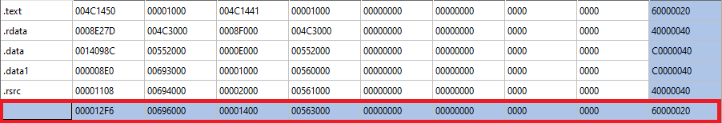

This new stub, manually made in assembly, loads a DLL dubbed ```Activation.dll``` and calls its export also without a name, using only the ```ordinal```. From there, the loaded DLL reconstructs the entire Import Table and decrypts the contents of the ```.text``` section in 16-byte blocks, and finally calls the original Entrypoint. See the new stub added in the games responsible for this procedure:

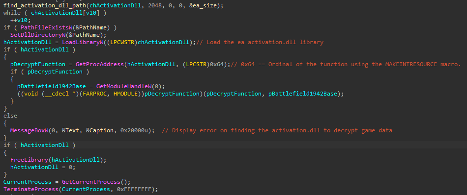

The game code is the same as the pirated versions found on the internet ```v1.61```, with the small difference of having no changes other than removing the SafeDisc DRM.

An interesting fact is that the developers at DICE used ```VirtualXP``` and a new branch of SVN to generate the game builds with the implementation of the new DRM:

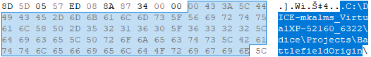

I will not go into further details of how this DRM works, as there are contents exploring other parts of it. Also, of course, not wanting legal issues (since this is research to revive the games and not to pirate them). However, I leave the curiosity of the creativity of the EA Games security team in protecting their games.


To continue with the Origin (EA Launcher) version, you can simply let the loader do the heavy lifting: rebuild the IAT and just set the EntryPoint (which will not be demonstrated here). However, just know that everything demonstrated here is applicable in the Origin/EA Launcher version, as the code base is exactly the same, just without the old DRM.

Nowadays, if you just get a copy of Battlefield 1942 from somewhere, like Origin/EA Launcher, disc, or somewhere in the depths of the internet, and go to play online, it simply won't be possible, as the server list no longer exists. However, if you find a server IP address on the internet, or host a server yourself, it is possible to play by adding it to favorites.

**You might be wondering why this happens?**

Basically, when you already know an IP address, there is no need for the master server list, as the Gamespy SDK itself sends requests asking for details of the server present in the list and, since it is active, only returns the relevant information to you.

**Now you must be wondering how this happens?**

Let's find out from now on, by fully analyzing and reversing Battlefield 1942 with the implementation of the 2002 Gamespy SDK present in it.


#### Reverting Packages

Some people had access to the complete Gamespy SDK at the time of the server shutdown, mainly large servers of those games that contacted them to obtain it, which is not my case. During the demonstration of how communication between client and masterserver, and client and server works, I will use my own reimplementation of the logic used by the reversed Gamespy Masterserver and soon show the implementation in the analyzed game binary.

Battlefield 1942 uses the following ports:

1. **28900** - For communication with the Masterserver list provider via the TCP protocol.
2. **23000** - For communication and obtaining information from servers via the UDP protocol.
3. Other connections use the TCP protocol and will not be addressed.

When a new server browser update request occurs, by clicking the button below:


A TCP connection to the Masterserver address via port 28900 is made, and when the connection is accepted, the first request is received by the client:


The command received by the client is as follows:

```\\basic\\secure\\MASTER```

This command indicates that a backend of the Gamespy for server browser provider is available to be consulted. This is an introduction of the Masterserver to the connected client.

Next, the Masterserver expects the client to provide a query for the game in question. This query consists of the following information:

1. Gamename.
2. Game Version.
3. Location, always default to zero (this is different in the case of Playstation 2 implementations, which had different games by region).
4. Validation, a standard hardcoded key. unique to each game, which can be considered an API key.
5. Enctype, default 2, but this referred to the version of the GOA (Gamespy Online Access) algorithm.
6. The magic delimiter to indicate the end of the frames, in this case always ASCII "final", this will make more sense as the explanation proceeds.
7. Query ID with the standard always being 1.1


Following this, we have the last request which, based on the above query, requests that the Gameserver Provider send the buffer compressed and protected with the GOA (Gamespy Online Access) algorithm:


Unlike the ```query```, the list has no meaning or configuration to be explained; it will just request the buffer containing the payload with the servers to be used.

Finally, after all this process, the protected buffer is sent by the masterserver provider fully encrypted (not in my case, because I removed the algorithm as my solution simply does not need it):


Before explaining how this was implemented and showing the entire explanation of the reverse engineering behind it, this is a real masterserver provider, hosted in Brazil, written and reversed in my free time, which will now become Open Source.


Let's look at how requests occur directly in the implementation of the Gamespy SDK present in Battlefield 1942.

#### Reverting the Gamespy Source Code and Implementation

Let's start with the procedure I nicknamed ```decrypt_tcp_traffic```. An interesting fact here is that the Gamespy SDK was completely developed in C, which made sense as it facilitated porting to other platforms/architectures. Well, continuing, going back to the explanation of the procedure, it is responsible for configuring the socket, reading the pending buffer, decompressing and decrypting, all with a maximum size of 2047 (this being the maximum size a Gamespy buffer can support). Additionally, it parses the data and adds it to a callback (from Gamespy itself) to be validated and, finally, added to a linked list and passed to the callback provided by the SDK implementer, in this case, DICE. Other callbacks were also implemented, such as error handling, which will make more sense as I present it.

Starting from the beginning, we have a call to ```select``` and then a call to ```recv```. The goal here is to monitor events for reading the socket, setting a timeout of 0 seconds for each event of the established TCP socket read. Returning an error code to GameSpy Switch (a code block that interacts in a loop, responsible for responding to external events directed at the SDK, as well as socket events such as presentation and authentication in the Masterserver provider), the returned code in question is ```STATUS_TIMEOUT_ERROR``` (obviously, this was defined by me based on the analysis of the code's behavior and my interpretation of it). Soon after, the buffer is read with a maximum size of ```2047```. This constant value is the maximum size that a payload (encrypted or decrypted set with server query frames) can assume. Here, note also that a global is used, ```readed_buffer```, a DWORD that stores the already read value with the previous payload size, in case a new interaction is necessary. This happens, for example, if for some reason the payload is corrupted.

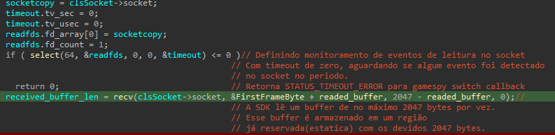

All data read from the payload is stored in a global, in a pointer composed of two globals. And here again, the creativity of the implementation is shown. The first global, ```FirstFrameByte```, is a byte, followed by ```readed_buffer```, which carries the offset/size of the previous buffer. It is worth noting that, most of the time, this value defaults to ```0```.

You might be asking yourself now:

**How can a single byte not overflow?**


The answer is yes! And that is indeed the goal. The developer aligned the data very well. When reading the buffer, it will always be larger than a byte, thus overwriting another global variable nicknamed ```frame_buffer```. It will actually carry the buffer without the magic byte (which, coincidentally, is always a single byte that, with an XOR of ```0xEC```, results in something greater than 0, as zero indicates that the payload generation was denied). See an example:


Now with the correct data, hehe:

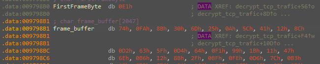

Following this, we have the checks for the size of the read buffer:


I separated this excerpt to show curious things to you, the reader. Here we can see the validations made by Gamespy regarding error handling when a buffer is not obtained from the TCP socket. But notice that, as mentioned earlier, a callback registered by whoever implemented the SDK in a particular game is registered. ```clsSocket->GamespyCallback``` is nothing more than the address of a DICE procedure that will receive the error code provided by Gamespy and based on a switch case will handle it, displaying the appropriate error message for it. Another curiosity here is that the parameters in the declaration can assume anything by the implementer, as it is a ```PVOID```. In this same callback, the linked list information of servers is returned.

Well, going deeper, let's understand how the data from a raw buffer, which is a payload, will be handled until we get relevant information that allows us to understand what is trafficked in this procedure.


From now on, we will see the use of GOA (Gamespy Online Access) in two procedures, the first ```decompress_one``` and the second ```decompress_two```, as well as the first stage of data parsing in a pointer to a data struct reversed by me, the ```server_data_struct```.

The first check in ```clsSocket->already_decrypted != -1``` is used in the cases already mentioned above, where the payload decryption has already been done previously but was somehow corrupted. So there is no need to work with the headers again, only with the body data of the payload. The algorithm responsible for this is in the ```decompress_two``` procedure. Moving forward, if it is the first interaction with the payload data, we will see the whole process of decompression and initialization of the key and decoding of the data header. The milestone for the start of this step is the comparison in ```already_decrypted == -1```:


Right at the beginning of this step, the first check using the magic byte 0xEC occurs, followed by the initialization of the key that is in the payload header through the XOR operation ```frame_buffer[i] ^= clsSocket->ucRandomicKeyBytes[i + 40]```. With each initialization, the keys in ```ucRandomicKeyBytes``` change and are constructed based on a rand, but this is just the first layer of encryption on the data that also has compression. After the key initialization, the ```decompress_one``` procedure is used to decrypt the payload header. Right after that, we have the offset value for the payload body, which is determined by the XOR of the magic byte with 0xEC (```FirstFrameByte ^= 0xECu```), which was used to access ```frame_buffer```, interpreted as a ```PVOID``` reference that I later identified as a struct (since it was accessed via indices in the assembly, similar to the pattern adopted by structs). Thus, I created the following struct:

```c++
struct server_data_struct {

  DWORD server_ip;
  WORD server_port;

};
```

Where I reached the following result, better facilitating our visualization of what was happening:

```c++
gameservers = (server_data_struct *)&frame_buffer[FirstFrameByte]
```

Where, finally, it was used as an argument so that the body content of the payload could be decrypted with a call to ```decompress_two```, in the following snippet:

```c++
decompress_two(clsSocket->ucBuffer, gameservers, (PVOID)(&FirstFrameByte + readed_buffer - (UINTPTR)gameservers));
```

This was the entire encryption routine and work with the frame adopted by Gamespy in this version. Although I made a complete port of this decryption routine later on in x86, I didn't dedicate time to analyze it thoroughly. However, it was the same shared by several games that used this version of the SDK. If you're interested in understanding it, I recommend reading the paper by another independent researcher, ```LUIGI. Auriemma```, specifically in a paper nicknamed ```GS enctype2``` available in the article references. Later on, I introduced new encryption in these frames using a modified and personal implementation of XTEA, nicknamed ```TeaDelKew```.

Right after all this process regarding the decryption algorithm, we reached the stage of creating the linked list responsible for creating a processing queue to check the server status using the ```UDP``` protocol with the default port ```23000```.


In this procedure, each member of the struct is accessed: the IPv4, the port, and the struct pointer is incremented by 6 bytes, the exact size of the struct itself to access the next set of data. Right after, all these data are passed as an argument to the linked list in ```add_to_list_to_check_status_via_UDP```. 

If you are wondering how the maximum payload size is defined in this parsing, it occurs based on the (UTF-8) signature ```\\final\\```:

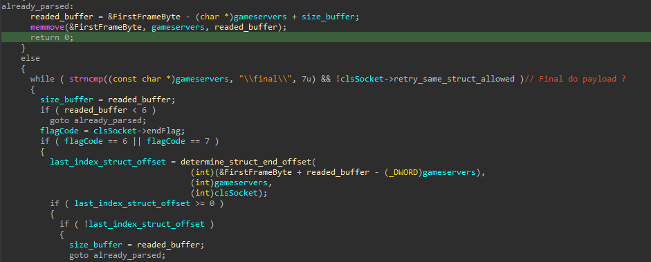

In this procedure, when the last frame is parsed, endFlag will assume the default value of 7, and then the procedure is terminated, all this while the signature ```\\final\\``` is not found, which precisely delimits the maximum size in case something fails.

Now let's turn our attention to how server validation is done by the Gamespy SDK using the UDP protocol. This check can be considered a kind of heartbeat since communication occurs only to get server details like player numbers, maps, and the name of the map being played. Let's start by analyzing the packets:


When the GameSpy SDK checks a server, the first command sent is ```\status\```. This command is used to request the proper heartbeat information of the server in question. The server then responds with other payloads, as exemplified below:

```
\gamename\bfield1942\gamever\v1.61\language\English\location\1033\averageFPS\0\content_check\0\dedicated\1\gameId\bf1942\gamemode\openplaying\gametype\ctf\hostname\NOME DO SERVIDOR | LOL NOME DO SERVIDOR\hostport\14567\mapId\BF1942\mapname\wake\maxplayers\64\numplayers\36\password\0\reservedslots\0\roundTime\1200\roundTimeRemain\274\status\3\sv_punkbuster\0\tickets1\0\tickets2\4\unpure_mods\\version\v1.61\active_mods\bf1942\allied_team_ratio\1\allow_nose_cam\yes\auto_balance_teams\on\axis_team_ratio\1\bandwidth_choke_limit\0\content_check\0\cpu\3766\external_view\on\free_camera\on\game_start_delay\15s\hit_indicator\on\kickback\10%\kickback_on_splash\10%\name_tag_distance\200\name_tag_distance_scope\350\number_of_rounds\1\soldier_friendly_fire\40%\soldier_friendly_fire_on_splash\40%\spawn_delay\4s\spawn_wave_time\7s\sv_punkbuster\0\ticket_ratio\250%\time_limit\30\tk_mode\forgive\unpure_mods\\vehicle_friendly_fire\40%\vehicle_friendly_fire_on_splash\0%\queryid\6903.1
```


**Confused with the returned information?**

Firstly, at the time of release, "JSON" was not that common. In fact, it was just starting to be used (as it emerged in the same year). But this is not a problem, except for the 2005/2006 versions that still used XML in GameSpy communications, which was standard for the player registration system. The presented model was common and worked well for the required standard. This standard was not exclusive to DICE/EA; other games of the time shared the same model. The difference was only in the received information since each game interpreted them differently. Some standards were maintained, which I will highlight now:

- **gamename** - Represents the name of the game for which the server was configured, in this case, "bfield1942".
- **gamever** - Represents the game version, in this case, v1.61 (the most current version of the game). If this version was different from the client, an error callback was triggered.
- **hostname** - Represents the name of the server in question.
- **hostport** - Represents the server port.
- **queryid** - Represents the ID of the query made on that server, in this case, 6903.1.

These were just the standard fields of the frame (which other games also had), but GameSpy was highly adaptable, and all other fields were specific to Battlefield 1942.

The first part presented was just the introduction received from the server. Other standard information was also received, such as information about the current players on the server, K/D (Kill, Death), ping, and time played, and of course, the keyhash (something interesting that will be explained soon what it's for).

```
\deaths_0\2\keyhash_0\e09833b4065c325fbe042d4c7cf8bba9\kills_0\0\ping_0\41\playername_0\[Admin]Cher\score_0\0\team_0\1\deaths_1\10\keyhash_1\d8e803a4c432c5dbc129805bb13c5ae9\kills_1\0\ping_1\52\playername_1\Jim Lahey\score_1\13\team_1\1\deaths_2\0\keyhash_2\92ff73033c3351d61131b3129990aa77\kills_2\0\ping_2\17\playername_2\jake from state farm\score_2\0\team_2\1\deaths_3\7\keyhash_3\114d0844ea3df43d48840016f2b4a7ae\kills_3\17\ping_3\24\playername_3\TheCalmingClam\score_3\34\team_3\2\deaths_4\2\keyhash_4\93b6ad5f0452ee5ff76702ae3f071e9e\kills_4\19\ping_4\21\playername_4\mediocre\score_4\23\team_4\2\deaths_5\4\keyhash_5\860bd844411700821c06d91751a22f13\kills_5\10\ping_5\25\playername_5\*Incognito*\score_5\26\team_5\2\deaths_6\12\keyhash_6\e189e41fc7254f4f1ad351b0aadeeeeb\kills_6\4\ping_6\151\playername_6\GLIER\score_6\13\team_6\2\deaths_7\6\keyhash_7\8f2cbe5d55b6f974199a0136b91791c4\kills_7\7\ping_7\31\playername_7\Lagtastic\score_7\26\team_7\1\deaths_8\7\keyhash_8\d0db7b12341ec39e07dbf686d7c0663e\kills_8\1\ping_8\77\playername_8\papi\score_8\12\team_8\2\deaths_9\9\keyhash_9\57592dcf0786e10a376577ad33c9d8d6\kills_9\7\ping_9\59\playername_9\Meuse\score_9\13\team_9\1\deaths_10\7\keyhash_10\8e024e9945e8cef5565e7eb67c63356b\kills_10\7\ping_10\44\playername_10\Sorrowful Rice\score_10\40\team_10\2\deaths_11\17\queryid\6903.2
```

As mentioned, all fields were customized for Battlefield 1942, unlike other games. However, there were still some standards, like the ```queryid``` itself. The ```keyhash``` was exactly the hash of your activation serial stored somewhere in the operating system (key registry in this case).

A curiosity about the game is that the serial verification was done on the client-side, working as follows: imagine you want to join a server, but your serial is the same as a player already connected. This was validated by the ```keyhash``` field. If your serial was the same as a player already connected, you would receive an error (a GameSpy verification callback, as detailed earlier).

**A problem here is that if you copy one of these keyhashes and replace it with yours, you can impersonate another player.**


##### [Bonus] Exploring registry key security to abuse the server serial problem to disconnect players.

If you are also curious about where these serial information are stored, there's nothing better than cracking a keygen/changer, obviously without delving into piracy. I reversed an old serial changer from Battlefield 1942; this changer used the ```ASPack``` packer and was completely made in ```Delphi```:


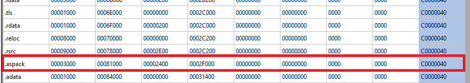

This software was just a changer. Its purpose was only to change the game's activation keys. It was not a keygen. Its only validation was to check if the serial had 22 digits in length and just wrote it in two registry keys without any security, as demonstrated below:

```\\SOFTWARE\\Electronic Arts\\EA GAMES\\Battlefield 1942\\ergc\\```

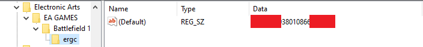

```\\SOFTWARE\\Aps\\cdkey\\```

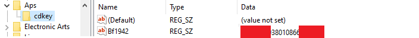

###### How was the hash generated for the serial key? Is it the same one used on the servers for verification?

To answer this question, we can look at Battlefield 1942's own implementation:


The value stored in the registration key is used to generate an MD5 hash of the values. It's possible to confirm that it was an MD5 just by observing the initialization constants present in the ```generate_data_md5``` procedure:

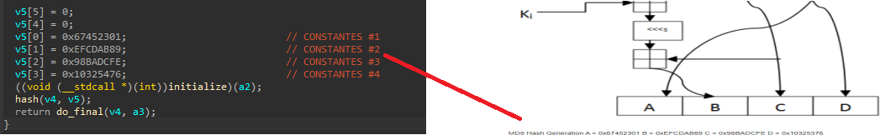

Furthermore, the output matches some keygen software available on the internet, in addition to my own test to confirm:


If you're wondering what would happen if two serials with the same hash were on the same server, both would lead to a disconnect, and we can abuse this just by hooking an MD5 implementation procedure. Can we consider it a vulnerability? It's your own personal interpretation of the subject.


##### Analyzing the server verification implementation of the Gamespy SDK in Battlefield 1942

After understanding how the serial worked and its security vulnerabilities, we will now turn our attention to see how server verification was implemented by the Gamespy SDK, directly in the source of the Battlefield 1942 implementation.

The procedure I nicknamed ```receive_data_from_masterserver``` is responsible for verifying each individual server from the list previously obtained by parsing the information from the payload received from the master server. With each frame (struct entry in the list), checking the total number of servers in it, the command query is sent to each individual server through a call to ```sendto``` using index ```0``` of the command query:


The mentioned global ```g_command_to_send``` contains all the commands that can be sent during the queries, clearly, with the correct order to the servers. However, here only index ```5``` is used, as it indicates the start of a new server status query that we already know:


```! Although not shown here, the other commands can also be used to obtain various information from Gamespy servers, ranging from basic information, rules, players, and rules.```

The ```status``` flag forces all possible server information to be sent. This will occur until a ```\\final\\``` is found, indicating the end of this information, as we can confirm based on the understanding of the original code:


For each obtained information, a Gamespy callback registered by DICE/EA will receive the data, parsing it as desired, separately and already organized. This callback is called until all frames are received, delimited by the ```final``` tag.

As a curiosity and also if you are wondering, yes, there is an error handling callback if something fails during the reception of the server information:


Let's understand how the frames are organized based on the information discovered and presented above. For this example, I am using a payload already decrypted and decompressed by ```GOA```(Gamespy Online Access):

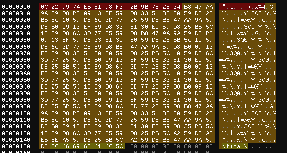

I highlighted with colors to make it easier to explain what each part that composes a Gamespy payload is.

- Starting with the red color, totaling exactly 0x13 bytes, we have the Frame Signature, the signature of the current payload. It does not matter much, but the SDK expects them to always be properly signed.

- In the light orange bytes, we have the servers and ports organized in the structure: 4 bytes for IPV4 (DWORD) and 2 bytes for port (WORD), all in a sequential manner.

- In the beige bytes, we have the "final" signature that delimits the end of the payload in question.
- All of this is limited to 0x7FF, which is the maximum size a payload can have.

**Curiosity, if you are wondering why the size is limited to 0x7FF and what happened if we had more servers than expected for a payload.** The answer is simple: because this is the maximum size that the server browser could support, and when we had more servers than this pointed to the master server, then some were picked randomly until the maximum size was completed and, finally, a new payload was created and returned to the requester. This is exactly why it caused the randomization of servers in the server browser list, generating opportunities for various servers to appear in it.

#### Writing a Packet Parser

After understanding how the GameSpy implementation worked and how the communication between client and server occurred, it's time to write a parser for this! For this, I will establish some objectives for our parser, which are:

- Fully parse the payloads.
- Organize information into constants.
- Organize server lists.
- Print and obtain all information from a payload.
- Add new servers.
- Remove servers.
- Check server status.
- Generate new payloads.

I started with the basics: I created a new project nicknamed ```EAGamesNetworkFrameParser```. In it, I created a new class called ```BF1942FrameNetParser``` to store all the methods to manipulate our payloads.

In this class, I created a new struct to store our servers, called ```BF1942gameServers```:

```c++
typedef struct BF1942gameServers {

	/*
		IPV4
	*/
	uint32_t dwServerIP { 0 };

	/*
		PORT
	*/
	uint16_t dwServerPort { 0 };

	/*
		Data to Display on SERVER BROWSER
	*/
	std::string status_response;

};
```

In addition to the struct to store information about the servers present in the payload, I created constants for Status-Query, End-Signature, Max-PayloadSize, and Max-StatusQuery (maximum size a server query payload can have):

```c++
const char* m_endSignature{ "\\final\\" };
const char* m_stausQuery{ "\\status\\" };
const int MAX_STATUS_SIZE{ 0x5DB }; // MAX status size
const int MAX_PAYLOAD_SIZE{ 0x7FF }; // MAX payload size
```

I also created declarations for two private raw pointers for the class. The first will be used to store the entire buffer of a payload, ```m_ucRawFrame```. The second buffer, called ```m_ucNewFrame```, will store the entire buffer later modified by whoever implements the class and wants to change the payload.

```c++
unsigned char* m_ucRawFrame{ NULL };
unsigned char* m_ucNewFrame{ NULL };
```

Following this, I created the following public methods focused on our outlined objectives:

```c++

// Constructor for our class receiving a path to the payload to be worked on
BF1942FrameNetParser( std::string& strFilePath );

// 1st Method responsible for adding a new server to the payload
auto addNewServer( const char* chSeverIp, const char* chSeverPort, bool check=true ) -> bool;

// 2nd Method responsible for removing a specific server added to the payload, using the index for this
auto removeServer( int index ) -> void;

// 3rd Method responsible for generating a new payload with updated data from the servers
auto getNewPayload( ) -> unsigned char*;

// 4th Method responsible for obtaining the raw payload. in this case a raw pointer for our payload in question
auto getRawPayload( ) -> unsigned char*;

// 5th Method responsible for writing a new payload generated on disk, basically this will generate a new payload with the updated data and then call rawpayload to obtain a raw pointer with the buffer to then write its contents to the specified path
auto writeNewPayload( std::string& path ) -> bool;

// 6th Method responsible for checking whether a server is active and obtaining all basic information about it. For this you need a struct BF1942gameServers containing the data of the server to be checked
auto checkServerStatus( BF1942gameServers* bfg ) -> bool;

// 7th operator method responsible for obtaining a std::string with all the server information present in a payload
operator std::string( ) const;
	
// 8th Destructor to cleanup the information used by our payload parser class
~BF1942FrameNetParser( );
```

After this small organization and standardization, I started implementing our parser itself.

Starting with the class constructor logic, it will be responsible for separating and organizing the proper procedures present in the payload. For this, as mentioned, I obtained the entire buffer of the file in the private variable ```m_ucRawFrame``` and used it as a base to work. First, I extracted the signature and stored it, then moved on to the payload body:

```c++
	
//Extracting the payload signature
std::memcpy( this->m_ucFrameSignature, this->m_ucRawFrame, sizeof( this->m_ucFrameSignature ) );

//Advancing to the beginning of the payload body
auto ptr = this->m_ucRawFrame;
ptr += sizeof( this->m_ucFrameSignature );
```

After that, I wrote the logic to extract the servers until the final signature was found in ```m_ucRawFrame```:

```c++

while ( std::memcmp( ptr, m_endSignature, sizeof( m_endSignature ) ) != 0 ) {

	BF1942gameServers srv{ 0 };

	std::memcpy( &srv.dwServerIP, ptr, sizeof( uint32_t ) );

	ptr += sizeof( uint32_t );

	std::memcpy( &srv.dwServerPort, ptr, sizeof( uint16_t ) );

	ptr += sizeof( uint16_t );

	this->m_servers.push_back( srv );

}
```

The code above repeats until it finds the signature that marks the end and, while repeating, extracts each DWORD-4 Bytes representing an IPV4 and advances to find the 2 Bytes-WORD representing the port, placing the collected data in a new instance of the struct ```BF1942gameServers``` and adding it to a std::vector.

With this, we already have all the information properly separated from our original payload, and I proceeded to implement our ```std::string() operator```. At this stage, I only organized the referred bytes that represented the IPV4 and the port and returned everything organized in a single std::string:

```c++
for ( auto bfServer : this->m_servers )

	out << ( bfServer.dwServerIP & 0xff ) << "." << ( ( bfServer.dwServerIP >> 8 ) & 0xff ) << "."
			<< ( ( bfServer.dwServerIP >> 16 ) & 0xff ) << "." << ( ( bfServer.dwServerIP >> 24 ) & 0xff )
			<< ":" << _byteswap_ushort( bfServer.dwServerPort ) << "\n";
```

Thus:

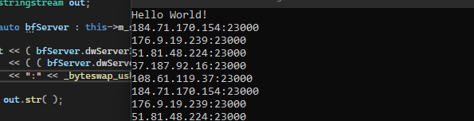

With this result, I proceeded to implement the method to add new servers to our m_servers vector. For this, I adopted the following steps:

First, I initialized a new struct ```BF1942gameServers```:

```c++
BF1942gameServers srv{ 0 };
```

Second, I prepared the parsing of information from a raw pointer ```const char*```, organizing the data individually in the fields of the initialized struct:

```c++
int b1{ 0 }, b2{ 0 }, b3{ 0 }, b4{ 0 }, port{ 0 };

sscanf_s( chSeverIp, "%d.%d.%d.%d", &b1, &b2, &b3, &b4 );

sscanf_s( chSeverPort, "%d", &port );

srv.dwServerIP = (b4 << 24) |
		 (b3 << 16) |
		  (b2 << 8) |
		  	  b1;

srv.dwServerPort = _byteswap_ushort( port );
```

Next, I started implementing the logic to check the server status using the query server-browser status, centralizing in the procedure ```checkServerStatus```:

```c++
.
.
if (sendto(sockfd, this->m_stausQuery, strnlen_s(this->m_stausQuery, 20), 0, reinterpret_cast<struct sockaddr*>(&serverAddr), sizeof(serverAddr)) == SOCKET_ERROR)
.
.
recvfrom(sockfd, chBufferStatus, MAX_STATUS_SIZE, 0, reinterpret_cast<struct sockaddr*>(&serverAddr), &msForcingAPointer);
.
.
bfg->status_response = std::string(chBufferStatus);
.
.
return true;
```
If the server to be added passes the status validation, I proceed to add the struct instance for that server to the ```m_servers``` vector.

I will not comment on the implementation of the ```removeServer``` procedure as it is very simple, being just the deletion of an item from the ```m_servers``` vector.

Focusing on the explanation of the ```getNewPayload``` procedure, it is responsible for generating a new payload from scratch with all the information altered and added by our parser.

First, we will allocate a new buffer with the maximum size the payload can assume:

```c++
this->m_ucNewFrame = new unsigned char[ MAX_PAYLOAD_SIZE ] { 0 };
```

Right after that, we copy the payload signature:

```c++
std::memcpy( this->m_ucNewFrame, this->m_ucFrameSignature, sizeof( this->m_ucFrameSignature ) );
```

Based on each server in the ```m_servers``` vector, I start copying to the new payload:

```c++
for ( auto server : this->m_servers ) {

	std::memcpy( ptr, &server.dwServerIP, sizeof( uint32_t ) );

	ptr += sizeof( uint32_t );

	std::memcpy( ptr, &server.dwServerPort, sizeof( uint16_t ) );

	ptr += sizeof( uint16_t );

}
```

And after that, I include the signature that will mark the end of the payload for the GameSpy SDK 2002 parser:

```c++
std::memcpy( ptr, m_endSignature, strnlen_s( m_endSignature, 10 ) );
```

The other procedures were also implemented by me following the same logic, but I did not consider them as relevant to highlight here, respectively:

```
writeNewPayload
getRawPayload
~BF1942FrameNetParser
```
Always consult the source code of this research for high precision in the implementation.

Finally, at the end of everything, we have our fully functional payload parser:


So, we managed to overcome this stage, let's move forward with our research.


#### Analyzing and creating ideas for modifications

Now, let's get to work and modify the GameSpy implementation, adding our own code to work with our own payload and, in this way, revive the Server Browser of Battlefield 1942. We will do this through a module nicknamed by me as ```kurumi```. The idea is to make something adaptable and intelligent to achieve our goal.

#### Analyzing Code Patterns

I will start the presentation of the implementation and modification of the GameSpy code. I will show where and why I chose certain routines to override/rewrite in a new region, directing the code execution and thus maintaining compatibility with the original code. And of course, how I used a super-performant and stable framework to disassemble and maintain compatibility for these implementations.

The Kurumi project was organized in a very simple way, consisting of only two files, one of which was completely written in Intel Assembly, focusing on support for Masm (Microsoft Macro Assembler), avoiding using new features of the C++ language due to possible incompatibilities that could arise with Battlefield 1942.

In total, I worked on only five specific points of the GameSpy implementation, already considering code redirection for own implementations or very specific patches. I created a configuration struct in ```Kurumi``` called ```BF1942_GS_NETWORK``` and each field was named with a friendlier name by me:

- bf1942->pReadBuffer
- bf1942->pGamespyDecompressRoutine
- bf1942->pSetReadBufferGsReturn
- bf1942->pSetDecryptRoutineGsReturn
- bf1942->pFirstByteAddrMagicByte

The first of these points is ```pReadBuffer```. Originally, this routine was responsible for managing the buffers read from the TCP socket established with the Master Server List Provider. Kurumi inserts a simple redirection code that stores all the register context and then redirects it to an area of my own control, where I completely re-implemented the original logic in assembly, with the only difference being that a buffer of my control will be used. As the idea of the implementation is to be as non-intrusive as possible, I adopted this approach. See an example:


This is the original GameSpy routine that I will rewrite in a new region, without limitation to add my own handler for the buffer to be read:

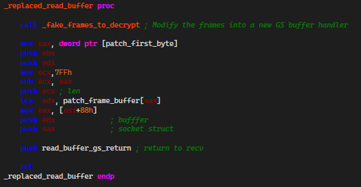

The second of these points is the ```pGamespyDecompressRoutine```. It is responsible for decompressing the received buffer and decrypting its content. However, now our buffer does not require this resource, so we replaced the original GameSpy handler with one of our own control, with the information that was read from our previous change, ```pReadBuffer```. Again trying to be as non-intrusive as possible, we just redirected the logic to a region with rewritten and adapted assembly for this purpose. See an example:


The purpose of this routine has already been presented in previous topics. See the re-implementation made:

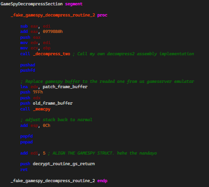

These were the only points that were indeed rewritten in Assembly by me. The remaining points will be highlighted now; they simply serve as configuration delimiters to redirect code between my implementation and the original implementation, and of course, mark globals used by GameSpy:

- ```pSetReadBufferGsReturn``` determines the return address of execution for pReadBuffer, where, after executing my own implementation, it returns to the original GameSpy code.

- ```pSetDecryptRoutineGsReturn``` determines the return address of execution for ```pGamespyDecompressRoutine```. After executing my own implementation, from where the execution would continue in the GameSpy code.

- ```pFirstByteAddrMagicByte``` stores the address of the global that stores the magic byte of the payload (xored with 0xEC), one byte before where the payload is stored. The functioning has already been detailed in previous topics; this information was used by me to have greater control and replace it with my working buffer.

**How did you abstract all this? Wait, this got very simple, didn't it?**


Yes, and that is indeed the goal. I spent a good amount of time reversing and discovering how to do it effectively. I wanted to develop something simple, practical, and as non-intrusive as possible, that was stable and without many modifications in the original GameSpy implementation. To determine and find the correct patterns, alter the masterserver address, in everything possible. For this mission, I used a disassembler framework developed by Bitdefender, nicknamed ```bddisasm```. You may question me why I chose it, and I simply answer that it is my personal preference. I find the functioning of this framework very lightweight and practical. Let's understand how I did it:

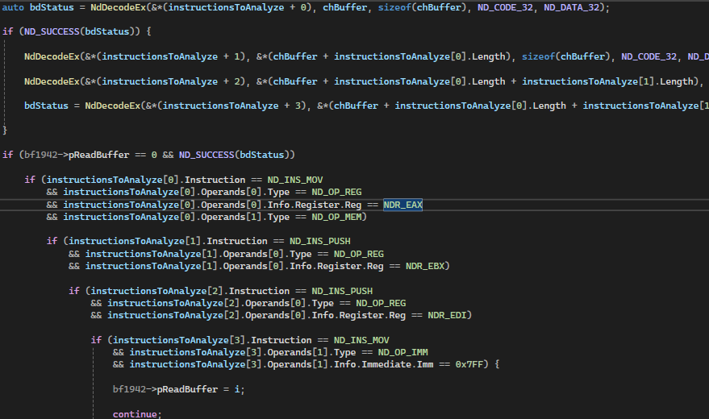

My implementation scans the correct region where the signatures should hit, all in the most optimized and assertive way possible, regardless of the Battlefield version used (CD or Origin/EA Launcher), finds the correct address and repeats disregarding the already scanned region to find the other patterns and retrieve their virtual address, storing them in the appropriate fields of the struct ```BF1942_GS_NETWORK```.

The same idea applies to searching for the masterserver addresses used by the game. For example, the default masterserver address used in Battlefield 1942 is ```master.gamespy.com```. My logic simply searches for the address and replaces it with ```kotori.keowu.re```, which is my own master server provider. By default, the master server provider address presented from ```gamespy.com``` was configured from the own initialization struct of GameSpy, and coincidentally this address is also configurable in the Kurumi module from the field ```MasterServer``` of the struct ```BF1942_GS_NETWORK```:


! Finally, we have reached the end of this presentation of my approach to substituting and re-implementing the GameSpy SDK code. If you are interested, check out the source code for more details and curiosity (or even a gameplay).

Let's now write a new Master Server List Provider for our new module ```Kurumi```, based on all the processes learned so far.

#### Writing a new Master Server List provider

Writing a new Masterserver is not such a complex task thanks to all the understanding and inputs we generated with our reverse engineering and documented in this article. For this task, I chose the C# language with the .Net Framework 8 version because it is highly portable, and I can generate a release that will run on both Windows and Linux (yes, this is possible through deploy configuration. I will explain how to do this).

I organized the development of a simple Masterserver into stages, which are:

1. Create a base class for TCP Socket support.
2. Define a listening method for clients to be connected.
3. Create a HandleClient method for each client connected to the server.
4. Prepare the payload file so that whenever a new client connects to the server, the content is sent.
5. Send the message ```Hello``` -> ```\\basic\\secure\\MASTER``` right at the beginning of the connection with the client.
6. Receive the client's query requesting the server payload ```bfield1942\\final```.
7. Verify if the client's query was received and send the appropriate payload to the client.
8. Wait for the client to close the connection.

There's no secret, the code is a simple TCP socket that will accept connections to port ```28900```, which is the same port used by Gamespy.


The main point here is the implementation since we have fully presented the protocol in the previous topics. So here we will focus on presenting how the communication between the client and the server was implemented:


When a client connects, I get the latest payload from the binary generated by the ```EAGamesNetworkFrameParser``` project, send the presentation command/message ```\\basic\\secure\\MASTER```, and then start an infinite loop to receive the query command sent by the client, clearly validating any exception and handling unexpected cases, such as a client disconnecting abruptly. However, to send the server payload, it is necessary to search for the final prefix indicating the last authentication sent. Upon receiving it, I only send the content of our server payload to the client and close the socket.

Since our intention was not to implement all the features offered by Gamespy, such as server query filters, I focused on the basics, which is to correctly send the server list in the way the game client expects. From this, with this simple implementation, everything will work well!

Wait, is that it? Is this a simple Masterserver emulator?

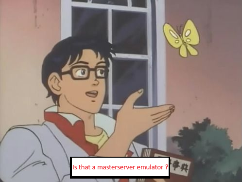

The implementation is simple when you already have the foundation for it. There is a whole process of understanding the protocol and how the game worked before actually implementing all the features seen here in this article. One thing leads to another, and with each small step, we have a great achievement, in this case, a fully functional Gamespy Browser Server List at our disposal and control for all games released using the 2002 SDK.

**If you are wondering how the deploy to Linux works**, it is relatively simple:

Generating a build using Visual Studio 2022:

- With the project open, go to the ```Build``` menu > ```Publish Selection```.

- Select ```Folder``` in the open dialog options, press next and repeat the same process.

- Define the directory to save the build for Linux and click ```Finish```.

- Click on the ```Show All Settings``` option in the open publish. Click the select box for ```Target Runtime``` and select ```Linux-x64```, check the ```Produce Single File option```, and click ```Save```.

- Finally, click the ```Publish``` button and just wait for the solution to be compiled.

- Go to the directory, copy the generated ELF binary and proceed to prepare your target Linux.

Preparing the environment on Linux:

- I will not detail the process of installing Dot Net Runtime 8.0 (no secret, the resulting binary will provide you with download instructions).

- Set the environment variables: ```export DOTNET_ROOT=/home/ubuntu/gamespymasterserver/dotnet8.2```, ```export PATH=$PATH:/home/ubuntu/gamespymasterserver/dotnet8.2```.

- Open the necessary ports on your firewall: ```sudo firewall-cmd --add-port=28900/tcp```.

- Run the compiled binary: ```./GameSpyMasterServer &```.

- ! Depending on your hosting platform, it is necessary to configure the TCP port through the provider's panel.

See how our Masterserver works fully in conjunction with the entire project:

GameSpy Master server waiting for new clients:

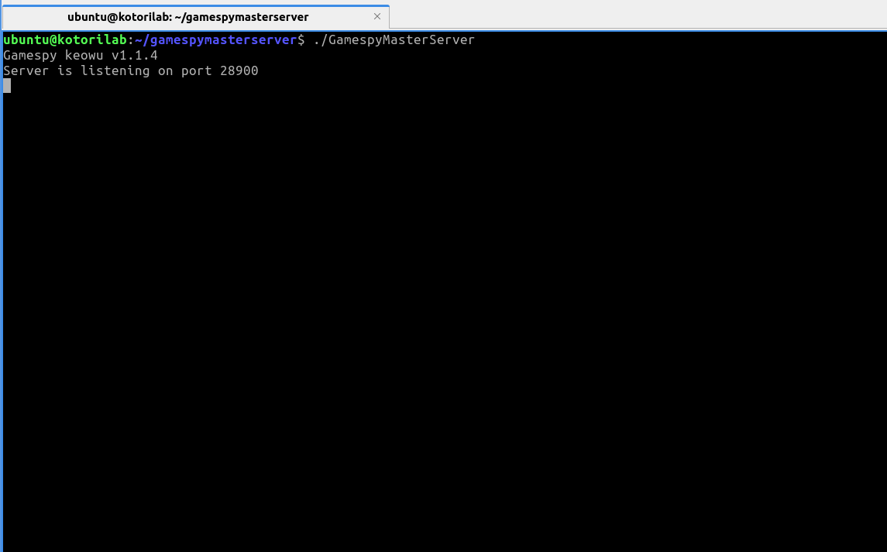

A new client connected and disconnected right away:


Meanwhile, on the client side, all servers are successfully rendered based on the server payload generated by us:

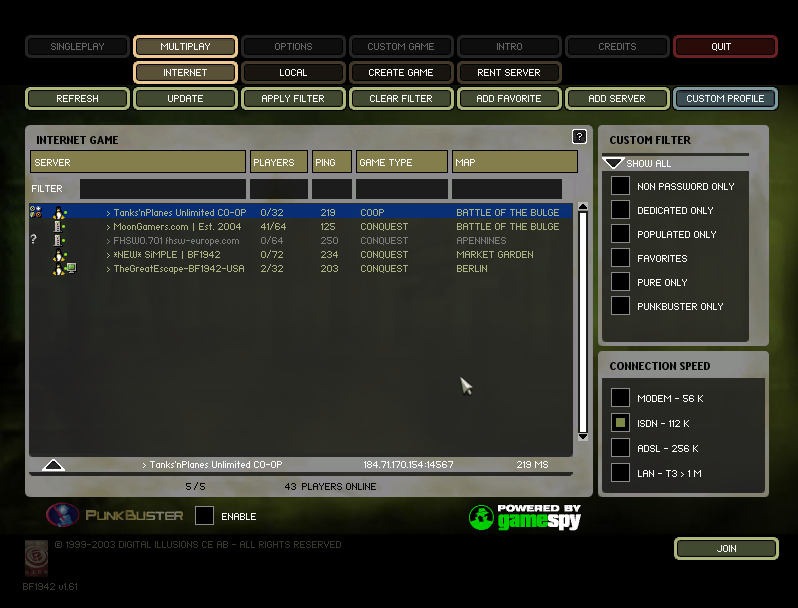

#### Testing the project

Let's now test the results obtained from our research. Here we will have demonstrations in YouTube videos of everything working perfectly:

**DEMO 1(Dev showing the project):**

[](https://www.youtube.com/watch?v=VOKm6LyfC30)

**DEMO 2(Small Gameplay):**

[](https://www.youtube.com/watch?v=XSBIUQTtwIg)

## The Gamespy of 2004 (Used by Bungie and EA)

The implementation of GameSpy 2004 used and implemented by Bungie and EA in their games has some significant differences compared to the 2002 version used by Battlefield 1942. Let's understand each detail of how it works from the moment of receiving the payloads, implementation, to parsing and finally writing the complete MasterServer under our control. Additionally, we will correct the games that implement it so that they work through our new MasterServer provider under our control.


#### A little about EA Games vs Bungie's stance

Before we continue studying GameSpy, let's understand a bit about how companies positioned themselves to save their titles right after GameSpy's shutdown in 2014. As expected, EA Games made its classic move of simply not acting and letting its titles die. Bungie, on the other hand, showed care for its titles by obtaining the code provided by IGN at the time and hosting them on their own in an AWS-EC2 instance, on the domain ```*.hosthpc.com```:

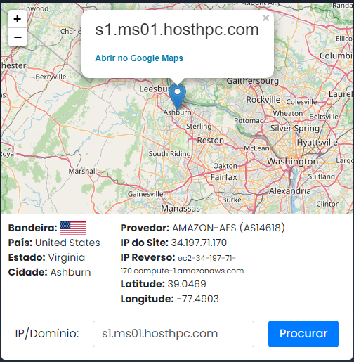

So, if you currently still have Halo CE, you can simply apply a patch provided by Bungie itself and continue playing without any impact. However, throughout this article, we will use Halo and also offer support, thus ensuring it will never die if Bungie decides to shut down its servers like EA.

### How network communication occurs

The following ports are used by the Gamespy 2004 SDK:

1. **28910** - All communication between the MasterServer and the game occurs through this port using the TCP protocol.

2. **2302[Fully configurable]** - Just like in Gamespy 2002, servers and their statuses are checked through the UDP protocol, with the only difference being that this port is fully configurable in the servers' payload.

3. All other communications normally occur through the TCP protocol.

#### Analyzing the Packets

Let's understand how this happens in practice. For this, I will use my reimplementation of the Gamespy 2004 MasterServer. To simplify understanding how communications occur, let's break it down by details starting from the Gamespy query communication, its content, the reverse engineering of the SDK implementation, and finally, the received payload.

**Starting a new browsing request**

A browsing request is made when you interact with the ```Get List``` button present in games that implement Gamespy as a whole. In its 2004 version, it would be no different. Let's start a new request to capture the data being transferred. I will use Halo CE in this example, but, obviously, you can use other games. In the future, repeat the steps with Battlefield Vietnam. See how it was done:

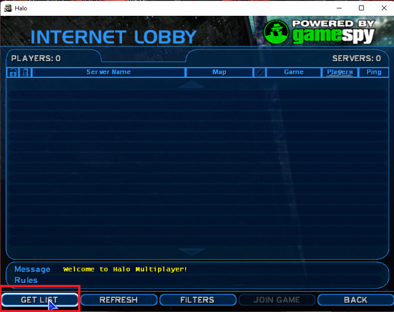

! After clicking the requesting button, let's analyze the information we were able to obtain.

**The Server Browser Auth**

If you are wondering if the authentication step we knew when we introduced Gamespy 2002 no longer exists, this step was removed in Gamespy 2004.

**The server browser query**

Once connected to the TCP socket of the MasterServer provider, the SDK sends the query for the game in question:


Compared to Gamespy 2002, we notice some small changes in the frame of the query in question, with only the duplicate game name:

```
halor\halor\hostname\gamever\numplayers\maxplayers\mapname\gametype\password\dedicated\game_classic\teamplay
```

Let's understand what each component of this query means:

- **halor\halor** - Game in question from which you want to obtain server payload. The value of this query is entirely defined and assigned by Gamespy to developers.
- **hostname, gamever, numplayers, maxplayers, mapname, gametype, gametype, password e dedicated** - Indicate which information the payload should contain. This is known as keys when referenced internally by the games that use the SDK. The payload is entirely oriented to them. That is, the SDK of another game that implements Gamespy may or may not contain the same fields or even more fields, depending, of course, on the developer who implements them.
- **game_classic, teamplay** - Are mandatory in any Gamespy 2004 query and are simply the basic filters that every developer must implement using the Gamespy callback.

**The Serverbrowser Payload**

Similarly to the 2002 version of the SDK, the 2004 SDK also implements the system of encrypted and compressed payloads with the proprietary GOA (Gamespy Online Access) algorithm, obviously with a completely different structure, which we will detail fully throughout our research.

Right after the query is sent to the MasterServer provider, it generates the payload and responds back to the Gamespy client:


Unlike the 2002 SDK, our payload has up to twice the capacity size compared to its previous version. That is, we can have a complete buffer with a maximum size of ```4096``` bytes. However, the previously mentioned concepts of server randomization with each new query still occur normally. That is, even if we have a much larger number of servers doing heartbeat on the MasterServer provider, we still have a random factor that always assigns them so that all online servers have the same prominence in the server browsing list.

Due to the size of the payloads, they are divided into two parts, with both completing each other:

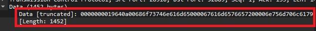


Before we go deep into how the payload is composed, let's understand how it is parsed, this time directing our studies to the reversed code implementation of Gamespy 2004.

**Reversing the server browsing implementation of Gamespy 2004 to understand its operation**

Let's analyze the process of working with the payloads received from the MasterServer provider by GS2004. During the analysis, I completely reversed the operation of the code that has this task of receiving, organizing, parsing keys and flags of the payloads, and, of course, the servers. The two important procedures responsible for all the work are ```get_socket_gamespy_buffer``` and ```execute_tcp_decryption```, both interconnected and dependent on their operation.

Before we go deep, we need to have a small knowledge base on how connection information is managed in the SDK. We have various status checks and connection integrity and status flags, and callbacks registered by those who implement the SDK. So, it is necessary to understand the base configuration structure of network sockets, here referred to as ```gamespysocket``` or ```clsGSCon```, with the following reversed declaration:

```c++
struct gamespysocket {
  UINT32 connection_status_flag;
  . . .
  UINT32 pGamespyBuffer;
  UINT32 actual_size;
  . . .
  void (__cdecl *throw_gamespy_connection_error)(UINT32, UINT32, UINT32, UINT32);
  UINT32 state;
  . . .
  UINT32 socket;
  UCHAR goa_header_key[276];
  UINT32 gs_state;
};

```
This struct is important and used to store all states and configurations related to connections made by the Gamespy 2004 SDK. Each field has a specific meaning that we will detail at this moment:

- ```connection_status_flag``` - Stores flags of the connection state currently assumed by the SDK. Flags such as: connected, disconnected, socket error, timeout, among others.

- ```pGamespyBuffer``` - Stores the reference to the payload read from the socket established with Gamespy.

- ```actual_size``` - Stores information about the size of the stored payload. This field is extremely volatile and variable, so even the SDK itself does not consider it reliable information (as we will understand how they actually check the size as we progress through the explanation).

- ```throw_gamespy_connection_error``` - Stores the callback function address for connection errors defined by the SDK implementer.

- ```state``` - State used to indicate where a particular Gamespy connection error occurred, basically the reason for its occurrence. Unlike connection_status_flag, which is internal, this value is returned to the developer's registered callback.

- ```socket``` - Is a conventional SOCKET reference established using the operating system's API to which it was compiled (this varies between operating systems, as Gamespy is cross-platform).

- ```goa_header_key``` - Is the encryption key for the connection headers obtained from the first payload directly from the header of the payload.

- ```gs_state``` - Stores state errors of the payload itself or custom settings, such as invalid flag information, usually occurring only when an SDK configuration is invalid or a payload from another game is received instead of the current game's flag.

After this brief introduction, we can start to dissect the reversed code of the ```get_socket_gamespy_buffer``` procedure. This procedure is responsible for checking if there are contents to be received in the active TCP socket established with the Gamespy MasterServer, as well as verifying the socket's integrity and the ```connection_status_flag``` indicating connection error states:


After the necessary integrity checks, the payload is read from the socket established with the MasterServer. This payload can have a maximum size of ```4096 bytes```. In addition to integrity checks to ensure that everything was properly received: ```if ( readed_size == -1 || !readed_size )``` and our first call to the developer callback informing the connection error ```clsGSCon->throw_gamespy_connection_error(clsGSCon, 4, g_nullserverref, clsGSCon->state);```, if everything goes well, we move on to the next stages, calculating the size of the received payload and specific SDK operational cases:


However, from now on, with a read and valid buffer, we can observe the call to ```execute_tcp_decryption(clsGSCon)```, the second most important procedure of all that will actually parse, decrypt, decompress, validate, separate flags and servers, and call the callback to populate the Server Browser implemented by the game developer. However, before we delve into its operation in detail, let's understand how the ```config_gamespy``` structure works, internal to the SDK itself, without access by the implementer, yet crucial for its operation.

```c++
struct config_gamespy {
  UINT32 state;
  . . .
  UINT32 keylist;
  . . .
  PUCHAR pDecryptedBuffer;
  UINT32 pDecryptBufferIn;
  UCHAR values_to_populate[1020];
  UINT32 num_populate;
  UINT32 expectedelements;
  void (__cdecl *ListCallBack)(UINT32, UINT32, UINT32, UINT32);
  UINT32 instance;
  . . .
  UINT32 ip_usuario_placed_requested;
  . . .
  UINT32 defaultPortGameservers;
  UINT32 callback_body_init;
  . . .
  UCHAR crypt_key;
  . . .
  UCHAR gs_query_flags;
  UINT32 pstate;
};
```

- ```state``` - Functions similarly to the gamespysocket structure, storing error codes and processing state of the server configuration parsing payload, used only internally in the SDK.

- ```keylist``` - Stores a reference to the current game's keylists, basically strings of entries, configurations, and game modes to be displayed in the server browser.

- ```pDecryptedBuffer``` - Buffer of the already decrypted and decompressed payload stored after the processing of GOA (Gamespy Online Access). This buffer is very important as it will be used for server parsing and tag work.

- ```pDecryptBufferIn``` - Pointer for store the Size of the total payload buffer, updated as it is processed and parsed.

- ```values_to_populate``` - Loads a list with servers and their defined ports parsed individually from the payload.

- ```num_populate``` - Number of servers in the list to be populated through the ListCallBack registered by the game developer who implemented the SDK.

- ```expectedelements``` - Size of expected key elements by the SDK implementer, varying for each game.

- ```ListCallBack``` - The callback registered by the developer who implemented the SDK, where they will receive a linked list of servers and their respective validated keys.

- ```instance``` - Instance of the server list that will store the data to be stored later.

- ```ip_usuario_placed_requested``` - IP address of the user who requested the list of servers from the MasterServer List.

- ```defaultPortGameservers``` -  The default port, if the default port accompanying each server in the payload is 0x0000 or 0xFFFF, this value will be used and assumed when obtaining server details.

- ```callback_body_init``` - Pointer to the exact start of where the payload data begins (skipping the accompanying header).

- ```crypt_key``` - Encryption key to be used by the GOA algorithm in the decrypt process.

- ```gs_query_flags``` - Flags used by the Gamespy MasterServer during server query.

- ```pstate``` - Only sets the encryption key status as initialized. 1 - Encryption key defined from the header, and 0 - No encryption key defined from the header.

After all this introduction, we can finally proceed to the second most important procedure to understand GameSpy 2004: ```execute_tcp_decryption```.

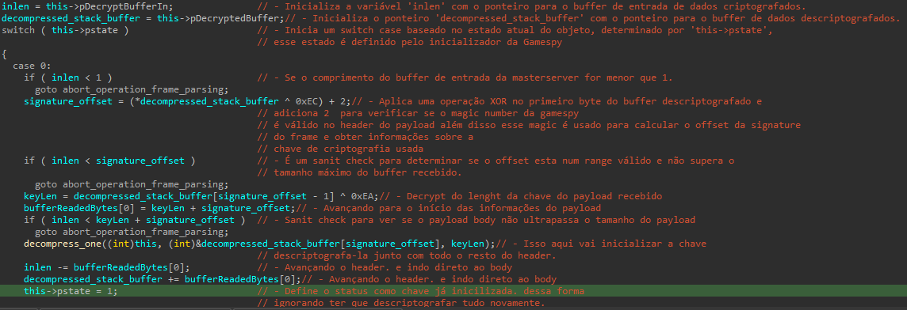

Right at the beginning of the procedure, we can see the logic responsible for obtaining the payload size and obtaining a reference to the payload stored in the connection struct previously read by ```get_socket_gamespy_buffer```. The goal here is to obtain the signature byte offset used to obtain the key from the GOA payload body ```signature_offset = (*decompressed_stack_buffer ^ 0xEC) + 2;```. This value must never be less than the total payload size. This XOR is not arbitrary, nor is the addition of 2. It is essentially decrypting the header information. Based on this offset, we have the first use of the value to perform an access ```keyLen = decompressed_stack_buffer[signature_offset - 1] ^ 0xEA;``` aiming to recover the size of the encryption key from the body. This value is also encrypted with an XOR. With the second use, the offset calculation for the beginning of the payload body is done ```bufferReadedBytes[0] = keyLen + signature_offset;```. This value will be used to discard all GOA header values and subsequently work only with the payload body. The algorithm responsible for decrypting and initializing the key is executed with the call to ```decompress_one(this, (int)&decompressed_stack_buffer[signature_offset], keyLen);```. We do not intend to reverse engineer GOA and its functionalities, so we will completely replace it later, also increasing the processing speed of the payload from our parallel MasterServer. Immediately after the initialization step of GOA, we have the recalibration of the payload offset to the body ```inlen -= bufferReadedBytes[0];``` and ```decompressed_stack_buffer += bufferReadedBytes[0];```, plus a very important field being defined: ```this->pstate = 1;```, previously presented as a control that GOA and the key were properly initialized. We conclude this first stage with the complete decryption of the payload body in ```decompress(&this->crypt_key, decompressed_stack_buffer, inlen);```, the most important part because now the actual data will be visible for processing.

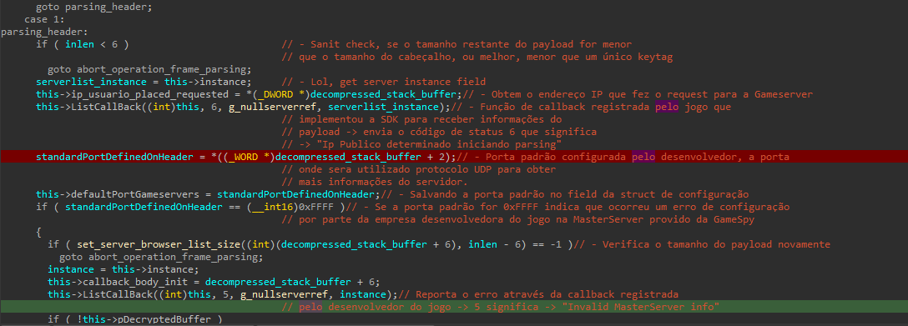

Immediately afterward, we can see that the instance field is retrieved ```serverlist_instance = this->instance;``` because the first callback from Gamespy will be made to the developer later. The values of the requester's IP address from the payload are also retrieved ```this->ip_usuario_placed_requested = *reinterpret_cast<UINT32 *>(decompressed_stack_buffer);```. After parsing the IP address, this data is presented to the developer who implemented the callback ```this->ListCallBack(this, 6, g_nullserverref, serverlist_instance);```, where it is up to them to decide whether to use it. Following this first callback, we have the parsing of the default port ```standardPortDefinedOnHeader = *reinterpret_cast<UINT32*>(decompressed_stack_buffer + 2);``` which will be stored in the internal configuration struct ```this->defaultPortGameservers = standardPortDefinedOnHeader;``` as mentioned earlier, these data are used when the server's port is not available during UDP protocol heartbeat checking. Some restrictions apply to this default value, it can never be ```0xFFFF```, meaning that parsing will immediately abort due to a configuration error by the developer. Following this, we have calculations of sizes and offsets until we reach the most interesting part:

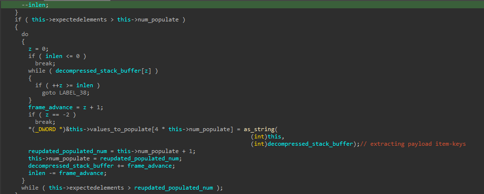

This routine is responsible for extracting each item-key from the payload. The item-keys are represented as valid ASCII characters and are part of the server browser list structure configuration, which the SDK will structure so that developers can use the information. Extraction occurs simultaneously with the current offset of the payload being updated ```decompressed_stack_buffer += frame_advance;```. The size of the section that stores the item-keys in the body is used in this interaction ```this->expectedelements > reupdated_populated_num```. However, we will not focus deeply on this topic, as this step is customized for each game and does not change between new payloads.

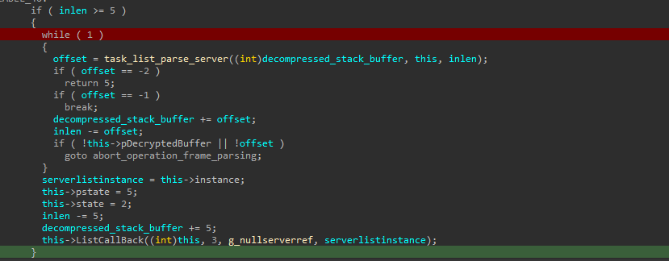

Moving further during the analysis, we finally reach the stage where servers are parsed from the payload, in addition to updating the developers who implemented the SDK before starting UDP verification at the end of server processing in the payload. The procedure ```task_list_parse_server``` parses each server individually and adds it to a list for later verification.


The procedure in question validates the current block of servers based on the status flag byte. The flags are completely customized by the developer and indicate the next offset to be added to access the next flag with the block of the next server in question. The flag scheme can be used to store other information that the developer wishes to include in the server blocks. Once the flags are validated, the procedure checks to see if it has reached the end of the payload by checking a DWORD constant ```LAST_SERVER_MARK_BYTES(0xFFFFFFFF)```. This magic value indicates that there is no more information and that the end has been reached, thus ending the parsing of servers. Otherwise, as long as this condition is not met, we continue parsing the servers. The procedure ```parse_server_ip_port``` is responsible for extracting the IP ```DWORD (4 bytes)``` and the server port ```WORD (2 bytes)```, followed by allocating a new entry for the server list ```alloc_server_item_for_list``` including the parsed information. Following this, there are two sanity checks for the new list created, the first being a check if the allocation procedure worked correctly ```isInvalidServer``` and the second to calculate the offset of the next server entry and the start of the next flag ```parse_server_validate```, concluded with the new entry included in the server list ```server_list_append_server``` which will be returned in the callback registered by the developer after parsing is complete.

**If you are questioning about the analysis for Battlefield Vietnam?**

The patterns are exactly the same (both for the above Halo CE analysis and for Battlefield Vietnam). There is no difference in implementation between SDKs in games, only in the configurations they use. In other words, everything presented here can be applied to any game using the Gamespy 2004 SDK.

Let's apply what we learned earlier and analyze a complete payload identifying each component that composes it (for this example, I chose Battlefield Vietnam):

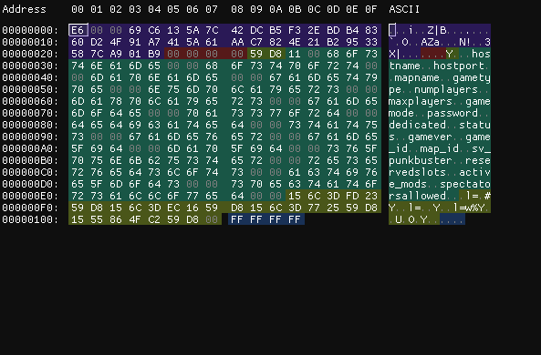

- In purple, we have the payload header - 37 bytes.
- In red, we have the requester's IP address for the MasterServer (00000000) - 4 bytes.
- In light green, we have the default port to be used during UDP protocol heartbeat verification (59D8) - 2 bytes.
- In green, we have the Item-Keys discussed earlier, which determine the queries and how the server browser, fully customized by the developer, is organized - 192 bytes or more.
- Next, in dark green, we have the blocks of flags and servers: 0x15 representing the default information flag, 4 bytes representing the hexadecimal representation of an IPV4 address, and 2 bytes representing the connection port (following the rules already presented).
- Finally, in blue, representing the final parsing delimiter of the payload.

Now, it's time to replicate all of this to manipulate and create our own server payloads.


#### Writing a Packet Parser for Gamespy 2004

Let's now completely reimplement the parser for GameSpy 2004 based on our knowledge acquired from the analysis. During the development of the parser, I focused on separating different logics for Halo CE and Battlefield Vietnam, but the concept will always remain the same for this version of GameSpy.

In this demonstration, I will use the Battlefield Vietnam parser; however, the source code of the Halo CE parser is very similar, and all this will be available for consultation and future research in the project repository. I will set some goals that we must meet at the end of this topic:

1. Completely parse the payloads.
2. Organize the payload information concisely.
2. Add and remove servers.
3. Change requester IP.
4. Display all servers and pertinent information about the payloads.
5. Generate a new payload with altered information.

I organized the project within the ```EAGamesNetworkFrameParser``` project, the same one already used to demonstrate the parser for GameSpy 2002. I separated the logic into two files: ```BFVietnamFrameNetParser.cc``` and ```BFVietnamFrameNetParser.hh```.

In the header file, I organized the configuration information and class structure and created a structure to organize the IP addresses and server ports, ```BFVietnamgameServer```:

```c++
typedef struct BFVietnamgameServer {

  /*
    Server IP
  */
  uint32_t dwServerIP;

  /*
    Server Port
  */
  uint16_t wServerPort;

};
```

This structure will be populated and stored in a vector for each server present in the parsed payload.

```c++
/*
 List with all servers and new servers into a payload
*/
std::vector<BFVietnamgameServer> m_BfVietnamServers;
```

Now, regarding the requester IP address information for GameSpy and the Default Port of the servers, I approached storing them in dedicated fields:

```c++
/*
  Requester IP Address
*/
uint32_t m_dwRequesterIP{ 0 };

/*
  Default Gameservers query port
*/
uint16_t m_dDefaultPort{ 0 };
```

Additionally, regarding the constants and default values for the flags used by the SDK, I also created dedicated fields for each one so that we can work more smoothly and organized later:

```c++
/*
  New flag delimiter flag
*/
const unsigned char m_ucServerDelimiterFlag{ 0x15 };

/*
  Payload signature flag
*/
const unsigned char m_frameEndSignature[5]{ 0x00, 0xFF, 0xFF, 0xFF, 0xFF };

/*
  Max payload size per server browser query
*/
const int m_MAX_PAYLOAD_SIZE{ 4096 };
```

If you are wondering how the methods of this class turned out, they look like this:

```c++

//1st Constructor of the class that will be responsible for receiving a payload file, extracting all the information and organizing it.
BFVietnamFrameNetParser(std::string& strFilePath);

//2nd Method responsible for obtaining the IP address of the author of the request to the MasterServer and returning it formatted in the IPV4 standard.
auto getRequesterIp() -> std::string;

//3rd Method responsible for defining a new IP address for the MasterServer requester.
auto setRequesterIp(const char* chIpv4) -> void;

//4th Method responsible for adding a new server to the payload, receiving as input an IPV4 address and a port
auto addServer(const char* chIpv4, const char* chPort) -> void;

//5th Method responsible for removing a server from the payload based on its index in the server list
auto deleteServer(int index) -> void;

//6th Method responsible for returning the new payload based on the current context of the payload class in memory
auto getNewPayload() -> unsigned char*;

//7th Method responsible for returning the raw payload already formatted with an updated state in memory
auto getRawPayload() -> unsigned char*;

//8th Method responsible for writing the updated payload to disk
auto writeNewPayload(std::string& path) -> void;

//9th operator method responsible for obtaining a std::string with all the server information present in a payload
operator std::string() const;

//10th Destructor to cleanup the information used by our payload parser class
~BFVietnamFrameNetParser();
  
```

I chose some methods to comment on a macro level and understand how they work, without delving too deeply into how they act technically. For this, I recommend that you **download the code and conduct your own experiments.**

Starting with the ```BFVietnamFrameNetParser``` constructor, responsible for parsing each part of the payload:

```c++

//Extracting the payload header, which I call "payloadSignature".
std::memcpy(this->m_payloadSignature, pSeek, sizeof(this->m_payloadSignature));

//Advancing by header offset size
pSeek += sizeof(this->m_payloadSignature);

//Extracting the requester's IP address for GameSpy
std::memcpy(&this->m_dwRequesterIP, pSeek, sizeof(this->m_dwRequesterIP));

//Advanced by the size of the requester's IP offset
pSeek += sizeof(this->m_dwRequesterIP);

//Extracting the default port defined by the developer who used the GameSpy SDK
std::memcpy(&this->m_dDefaultPort, pSeek, sizeof(this->m_dDefaultPort));

//Advanced by port offset size
pSeek += sizeof(this->m_dDefaultPort);

//Extracting the Item-keys from the payload
std::memcpy(this->m_payloadGameConfiguration, pSeek, sizeof(this->m_payloadGameConfiguration));

//Advancing the size of Item-keys + 1 byte for the first flag of the server block
pSeek += sizeof(this->m_payloadGameConfiguration) + 1; // +1 for ignore (magic flag 0x15) the first server delimiter

//Parsing the block of servers and flags, until finding the final magic.
while (std::memcmp(pSeek, m_frameEndSignature, 5) != 0) {

        //Checking if we have a server delimiter flag being used, if so, we will advance +1 byte to obtain the beginning of the next block.
	if (std::memcmp(pSeek, &this->m_ucServerDelimiterFlag, 1) == 0) pSeek += 1;

        //Starting a new structure to store data from extracted servers.
	BFVietnamgameServer bfVs;
	
        //Parsing the server's IP address
	std::memcpy(&bfVs.dwServerIP, pSeek, sizeof(bfVs.dwServerIP));
	
        //Advance to next offset
	pSeek += sizeof(bfVs.dwServerIP);

        //Parsing the server port
	std::memcpy(&bfVs.wServerPort, pSeek, sizeof(bfVs.wServerPort));

        //Advance to next offset
	pSeek += sizeof(bfVs.wServerPort);

        //Storing the structure with the data in our final vector, for later use.
	this->m_BfVietnamServers.push_back(bfVs);

}
```

The code above is responsible for parsing each of the data, first the payload header, followed by the requester's IP address, the default server port, followed by the parser of the Item-Keys defined as a specific configuration for the game in question, and ending with the total parser of each server and tags, until it finds the final payload signature with the magic ```0xFFFFFFFF```.

The ```writeNewPayload``` method is responsible for doing the reverse process of our constructor. It will create a new payload to store all the changes, doing exactly the reverse process of a parser, adding each block as: header, requester IP, default port, Item-Keys, and ending with the server blocks and their respective tags and with the Magic at the end, writing all this to a file on disk to be used by the MasterServer Provider.

Besides the constructor and the presented parser logic, the logic of the other procedures is very similar to what we saw earlier in the GameSpy 2002 topic. Therefore, since we have seen it before, I decided to skip the explanation of the following methods:

```c++
auto getRequesterIp() -> std::string;
auto setRequesterIp(const char* chIpv4) -> void;
auto addServer(const char* chIpv4, const char* chPort) -> void;
auto deleteServer(int index) -> void;
auto getNewPayload() -> unsigned char*;
auto getRawPayload() -> unsigned char*;
operator std::string() const;
```

**! However, once again, it is worth noting that they are available for consultation in the project's own repository.**

After writing our parser for GameSpy 2004, the time has finally come to start correcting it based on the knowledge we have acquired so that we have full control over the SDK.


#### Analyzing and creating ideas for GameSpy 2004 modifications

Now, in a similar way to what was done for GameSpy 2002, let's get to work and reimplement the payload receiving logics of the original MasterServer Provider to accept our own payloads and render them in the server browser list of games that implement GameSpy 2004. The new module for this task has been nicknamed ```kuromi```, and its goal is to effectively and optimally modify all logic and handlers for our own domain and control.

#### Analyzing GameSpy 2004 code patterns

To modify the GameSpy SDK, I created a new project nicknamed ```Kuromi```, developed in C++ and Microsoft Macro Assembly. This module is capable of identifying code patterns used by the SDK and redirecting the execution of original instructions to routines of our own control, as well as modifying all endpoints used by the original MasterServer Provider to our own, so that we can completely emulate the operation of GameSpy components at our own disposal, something somewhat similar to what we learned in the article with the ```kurumi``` module, but without many of the limitations imposed by the old EA game.

Kuromi is an extremely simple and intelligent module, using only the following new procedures for work:

- new_get_socket_gamespy_buffer_gs2004_stub
- new_goa_decrypt_buffer_gs2004_stub

With just these two procedures, I reimplemented the complete logic of the original procedures using Macro Assembly.

```new_get_socket_gamespy_buffer_gs2004_stub```:


```new_goa_decrypt_buffer_gs2004_stub```:

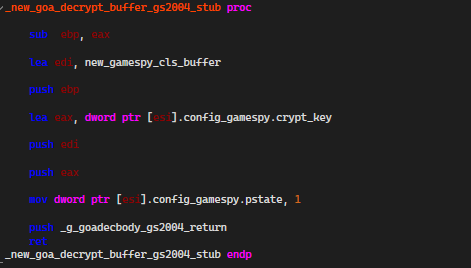

In addition to the new modified routines, we also applied all the reversed structures to be able to manipulate the SDK data and information much more efficiently in x86 code:


Similar to the ```kurumi``` module, this module is also capable of scanning the patterns used by GameSpy in order to find the correct addresses to redirect the execution of the original code:

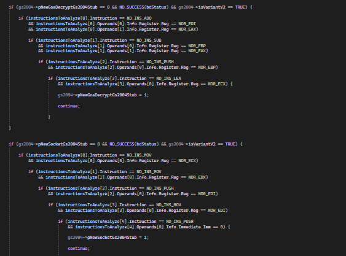

This scanning happens only within the range of the executable code section and, as the addresses are found, they are stored in the ```GS2004_NETWORK``` configuration structure, for later redirection.

In addition to searching for the procedures to be redirected, we have another very important routine, responsible for retrieving the ```MasterServer``` field from the ```GS2004_NETWORK``` and using it to change the original SDK endpoints to those under our control:

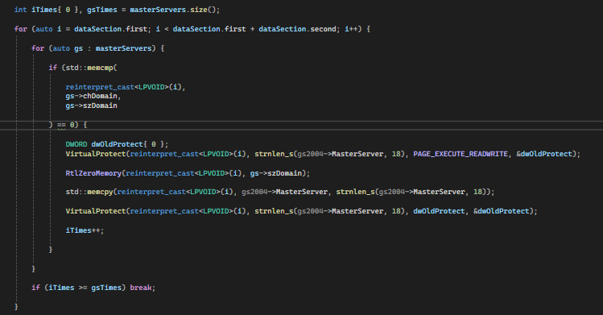

And with these routines, we completely conclude the necessary modifications to fix GameSpy 2004 and redirect it to our own control.


You may be wondering, similar to GameSpy 2002, if this became too simple. However, this is indeed the goal. There is no reason to be complicated. Our goal since we started reversing the SDK was to understand its operation in-depth, and this dedication ends up reflecting in the quality of the manipulations we make to it. Hence, such simplified, stable, and secure code.

Finally, let's move on to our final part: rewriting our MasterServer Provider to have everything effectively functioning.

#### Rewriting the MasterServer Provider for GameSpy 2004

To accommodate and support GameSpy 2004, I adapted the same code we previously saw in the excerpt we studied from GameSpy 2002. The main difference here is that we will support the connection through two different TCP ports, thus, I worked with two sockets instead of a single socket:

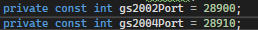

The basic operation of the MasterServer Provider was slightly modified. A TASK is created for each of the sockets, and the socket that responds asynchronously manages the received connection, directing it to the appropriate procedure with the prefix ```HandleGSxxxxClients```:

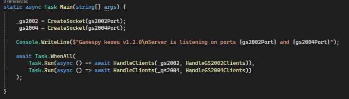

And, similarly to what we saw in GameSpy 2002, we respond to requests from our client in the way that the SDK needs and, at the end of everything, we send the complete payload to the client:

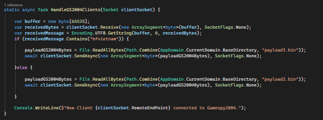

In this example, when a new client connects through the GameSpy 2004 port, we will check if the query contains ```Battlefield Vietnam``` or ```Halo```, and based on that, we only respond with the appropriate configuration payload generated with our previously explained parser algorithm. Similarly, this also happens with GameSpy 2002:

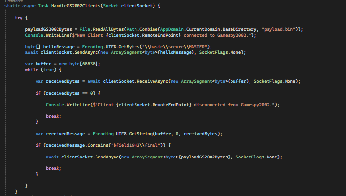

However, as we already know, it requires much more interactions and has many more queries for payload configurations, something that GameSpy decided to change in the 2004 version.

I will not teach the deployment process of the MasterServer Provider here, as it was already taught during the explanation of GameSpy 2002. So, let's finally move on to the tests of our implementations.


#### Testing the project

Let's get to the tests. For each of them, I separated two videos demonstrating the operation of our project, with the servers being displayed again in the server browser list, or even a gameplay.

**Testing Halo CE**

[](https://www.youtube.com/watch?v=2NNq4UT9Wgs)

**Testing Battlefield Vietnam**

[](https://www.youtube.com/watch?v=EmE7mOZOakc)

## Extra Ideas

##### Gameloader

If you're wondering how the modules are injected into GameSpy games for work, or how the development stage happens, it all occurs through software that stays hidden in the Windows tray icon called ```KewGameLoader``` or, for those familiar, ```KewGameSpyEmulatorClient```.

The ```KewGameLoader``` has the following capabilities:

- Identify when the process of games using any GameSpy SDK is started and inject the modules that fix them.

- Establish a functional debug interface so that the project developer and contributor can interact and monitor the project's performance and bugs.

- Display the game RPC status on Discord using the Developer SDK.

The ```KewGameLoader``` is a very important component for all of this. Let's explore it technically from now on.

- **Identifying GameSpy game processes via WMI:** the KewGameLoader, through the ```KewUsermodeProcessMonitor```, uses a Query implementation via WMI through COM to be notified whenever a new process is created by the operating system, causing minimal impact on our users' operating system. If you are curious about how this works, refer to the files ```KewUsermodeProcessMonitor.cc``` and ```KewUsermodeProcessMonitor.hh```.

- **Debug interface:** through the ```GameIPC``` on a secure thread, the KewGameLoader establishes a Named PIPE with the module present in the game (Kurumi or Kuromi), receiving very specific debugging and performance information that is displayed on the game's own screen with an overlay. If you are curious, refer to the header file ```GameIPC.hh```.

- **Secure Overlay Interface:** through the ```DevOverlayFrame```, the KewGameLoader can render information on the game's screen using the most updated OpenGL, without this overlay occurring internally, allowing it to be terminated externally in case of any problem. If you are curious, refer to the files ```DevOverlayFrame.cc``` and ```DevOverlayFrame.hh```.

- **Discord RPC:** through the main file itself ```KewGameLoader.hh```, we add support for the ```Discord Developers SDK``` library so that games and status are displayed on the platform. This was a feature requested by the project's testers.


The ```KewGameLoader``` is constantly evolving, and new features may be included in the future. Despite this being an initial research and base to ensure that games never die.

##### Window Mode Tips for Development

If you are looking for a more simplified way to work with the base provided here, it is certainly not in FullScreen. The biggest problem with older Battlefields is that due to key hooks and outdated DirectX 8 APIs, we encounter various window problems and bugs while working on improvements in our project, especially if you are using Windows 11. And solving this problem is quite simple.

I separated it into two stages, the first directed to Battlefields and the second aimed at Halo.

To solve the problem for Battlefield 1942 or Vietnam:

- Go to the game binary in the installation directory.

- Go to the properties of the game binary and then in Compatibility Mode, select ```run this program in compatibility mode for``` and choose ```Windows XP Service Pack 2```, then save.

- Now, still in properties, check the box ```Disable fullscreen optimizations```.

- Then, go to the following directories: ```C:\Program Files\EA Games\Battlefield 1942\Mods\bf1942\Settings```,  look for two files and open them in a conventional text editor: ```VideoDefault.con``` and ```Video.con```. Change the line ```renderer.setFullScreen``` to ```0```.

To solve the problem for Halo is much simpler:

- Go to the game shortcut on the desktop and modify the game's command line to add the argument ```-window```.

##### TeaDelKew

During the reversal, development, and writing of the article, the idea of a possible way to encrypt payloads similarly using an algorithm similar to ```GOA``` (Gamespy Online Access), but without compression, emerged. It was then that, after a good amount of time facing ```XTEA``` in another project, I had the idea to create an encryption based on it, which I called ```TeaDelKew```. I am not a mathematics expert, but I introduced some novelties in ```TeaDelKew```, specifically six:

- Introduction of the ```kew_box```, which are 12 constant values used for data permutation applied before the start of the XTEA encryption cycles.

- Unlike conventional XTEA, ```TeaDelKew``` uses 2048 iterations for each of the main encryption and decryption phases, which implies greater security, but at the cost of a bit more computational use.

- The original XTEA uses a simple application of the ```Feistel transformation```; ```TeaDelKew``` combines, in addition to the mentioned application, an XOR manipulation of the iteration values, as well as negates the result of their operations.

- In ```TeaDelKew```, unlike XTEA, right at the beginning, the raw or already encrypted text undergoes a negation before the initial encryption cycle.

- The keys of ```TeaDelKew``` are completely different from those of ```XTEA```; each part undergoes an XOR with the constant ```0xDEADBEEF``` before being applied in the calculations, thus modifying the original values.

- Finally, the decryption logic of ```TeaDelKew``` mirrors the original encryption algorithm, applying a reverse process and negation of results to obtain the original values, thus maintaining some characteristics found in ```XTEA```.

If you are interested in the mathematical representation of this (like those found in RFCs), I admit I am not good at it, but I did my best to create something decent in my free time.

For ```tea_del_kew_encrypt```:

- v0 and v1 are the halves (DWORD) of the raw input, initially negated.

- k0, k1, k2, and k3 are the keys derived using an XOR with ```0xDEADBEEF``` and a new delta of ```0x00B0B0C4```.

- ```kew_box``` is a substitution table with 12 hardcoded constants.

In the encryption process itself:

- We have an initial permutation with ```kew_box``` and the key values, using a loop from 0 to 2047:

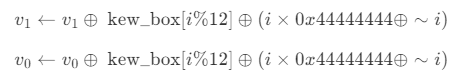

- Next, we apply the modified Feistel transformation, using a loop from 0 to 2047:


For ```tea_del_kew_decrypt```:

- v0 and v1 are the halves (DWORD) already encrypted by ```TeaDelKew```.

- k0, k1, k2, and k3 are the keys, obtained in the same way as in the encryption process.

- sum is initialized with the constant ```0x85862000```, and delta using the same constant as the encryption routine, in this case ```0x00B0B0C4```.

In the decryption process itself:

- We reverse the encryption process and first apply the inverse modified Feistel transformation, using a loop from 0 to 2047:


- Finally, we apply the inverse permutation using kew_box and the key values, with a loop from 0 to 2047:


As you can see, I took care when writing ```TeaDelKew```. Feel free to improve or fully implement it in the project.

The source code is available in the repository in a separate project, nicknamed ```TeaDelKewTests```, and its content includes only a header and a namespace called ```TeaDelKewAlgo.hh``` with the proper implementation.

##### Error track with MiniDumps

For greater stability of the solution proposed in this article, all modules support generating MiniDumps, which allows identifying and resolving issues. This can be further expanded in the future. The main information about this feature and where to find the generated files are listed below:

- For the Kurumi module, all MiniDumps are stored in the temporary directory in a folder called "KurumiBF1942", for example: C:\Users\YOURUSER\AppData\Local\Temp\KurumiBF1942.

- For the Kuromi module, all MiniDumps are stored in the temporary directory in a folder called "KuromiGS2004", for example: C:\Users\YOURUSER\AppData\Local\Temp\KuromiGS2004.

All dumps are generated following the Microsoft standard (moment of crash + prefix .dmp).

## Bla, Bla, Legal Stuff

When writing this article, I consulted with a lawyer. Therefore, I was advised to obtain all possible licenses for all mentioned games. Thus, the following titles were acquired:

- Battlefield 1942, digital version, acquired from an originally registered collector on the Origin platform in 2010 (year of purchase).

- Battlefield Vietnam, physical version, acquired from a collector who purchased it at GameStop around 2006.

- Halo CE, version provided directly by Bungie.

Other important details:

- I made several attempts with EA Games' technical support to acquire the digital version of Battlefield Vietnam. They both insisted that the game was no longer supported and that they were not responsible for it. A positive point was their attempt to activate the digital version on my account, in addition to the excellent attention received. There were even congratulations for the care taken with these classic copies and surprise at how I managed to get a sealed copy of this game.

Therefore, everything necessary for the construction of this article, from software licenses to the authenticity of the original games, has been provided. I emphasize that at no time will a playable version of the games be made available, and parts of game files, as well as links to third-party websites containing corresponding downloads, do not constitute a violation of Brazil's Copyright Law, Section 107 of 1976. Additionally, patch files or improvements also do not infringe copyrights, which applies equally to all source code and materials generated from this research.

## Reviewers, Testers, and Special Thanks

- Anderson Leite(github.com/buzzer-re): For having reviewed my article and collaborated with suggestions and improvements.

- Akko(github.com/AkkoS2): For having tested the functionalities in gameplay.

## Conclusion

Our conclusion is quite open; this article certainly provided gratifying moments of learning and personal satisfaction by highlighting titles that were important to me in various ways, ensuring they are appreciated by future generations. The opportunity to revive nostalgic feelings in communities or interested individuals is very rewarding. I hope this article can be used to generate even more improvements or facilitate future initiatives in this regard.

[](https://www.youtube.com/watch?v=18DLBcMg_5k)

! I conclude with a reference video that probably only Brazilians will be able to understand.

Keowu \^-^

## References

LUIGI. Auriemma Luigi Enctype 2 Papers. [S. l.], 27 abr. 2007. Disponível em: https://aluigi.altervista.org/papers.htm. Acesso em: 30 mar. 2024.

ERRI120. Breaking EA Desktop‘s pathetic Encryption. [S. l.], 18 jan. 2023. Disponível em: https://erri120.github.io/posts/2023-01-18/. Acesso em: 31 mar. 2024.