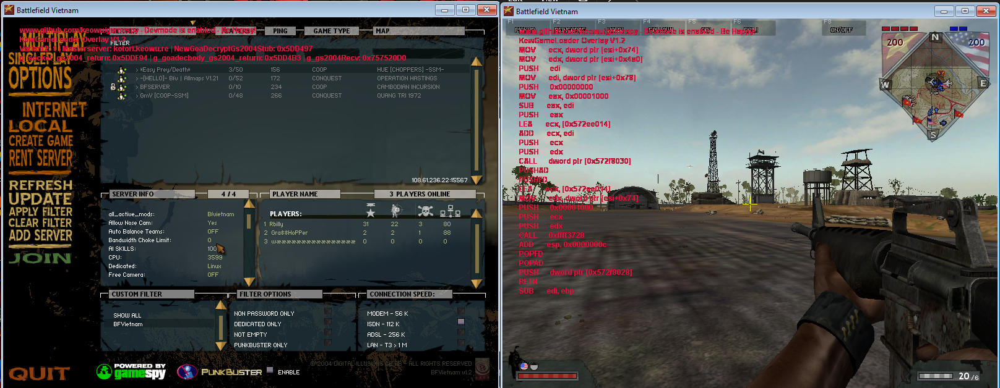

    <h1>Gamespy Emulator</h1>
    

A comprehensive paper documenting the operation of GameSpy from 2000 to 2004, derived through reverse engineering of Battlefield 1942, Vietnam, and Halo CE. This includes complete source code for correction modules, a full emulator, and network parsers tailored for each SDK version and its corresponding games. This resource also serves as a guide for porting support to any other game utilizing the now defunct GameSpy SDK.

### Code structure and a basic project description

The following structure represents this project:

- **`code_base/BungieMicrosoftHaloNetworkFrameParser/`**: A complete network parser for all frames and handling based on the structure used by the Gamespy 2004 communication protocol used by Bungie.

- **`code_base/EAGamesNetworkFrameParser/`**: A complete network parser for EA games using the following versions of Gamespy: 2002 and 2004.

- **`code_base/GamespyMasterServer/`**: A complete emulator of the server list providers capable of sending a customized payload to clients connecting using the Gamespy communication protocol.

- **`code_base/KewGameLoader/`**: A loader and a debug tool for Gamespy code with several useful functionalities so you can enjoy gameplay without breaking compatibility with the games.

- **`code_base/Kuromi/`**: The module responsible for intelligently modifying Gamespy 2004 at runtime so that our emulator works.

- **`code_base/Kurumi/`**: The module responsible for intelligently modifying Gamespy 2002 at runtime so that our emulator works.

- **`code_base/TeaDelKewTests/`**: A proposed replacement encryption algorithm for the original GOA used by Gamespy (2002 and 2004) and its variations.

- **`ida_databases/`**: Contains all IDB files used in the reverse engineering process of the GameSpy SDKs.

- **`paper/`**: Contains papers in two different languages, Portuguese and English, to aid in understanding each part of the project and how the research on Gamespy was conducted.

- **`others/`**: Contains other files that may assist individuals interested in deploying the MasterServer Provider emulator and other items that do not fit into the other categories.

[ ! ] This is a research project, but if you believe having good questions or if you're going to host this and need an Anticheat to protect the gameplay, contact, maybe we can help with something: [Research Discord Server](https://discord.gg/fWhvHXtzxy).

### Papper and Research Information

To obtain complete information on how the code works, such as the process of deep reverse engineering. and understand the project as a whole, I recommend reading the following paper, available in English and Portuguese:

- [Rewriting completely the GameSpy support from 2000 to 2004 using Reverse Engineering on EA and Bungie Games](https://keowu.re/posts/Rewriting-completely-the-GameSpy-support-from-2000-to-2004-using-Reverse-Engineering-on-EA-and-Bungie-Games/)
- [Reescrevendo totalmente o suporte da GameSpy de 2000 a 2004 usando engenharia reversa em jogos da EA Games e Bungie](https://keowu.re/posts/Reescrevendo-totalmente-o-suporte-da-GameSpy-de-2000-a-2004-usando-engenharia-reversa-em-jogos-da-EA-Games-e-Bungie/)

#### Screenshots

##### Some in-game screenshots

##### Testers' vision screenshot (Only in Halo CE)

### License

This project/research is licensed under the **GNU General Public License v3.0**.
